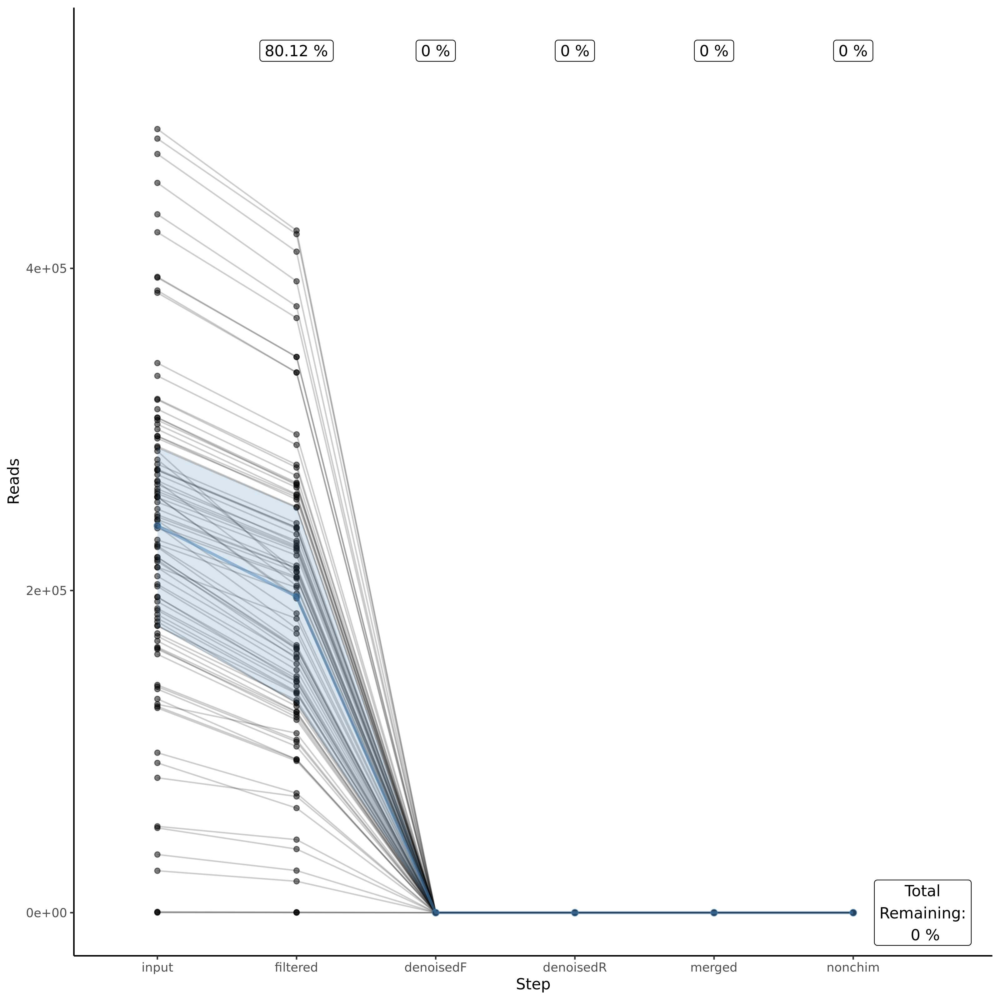
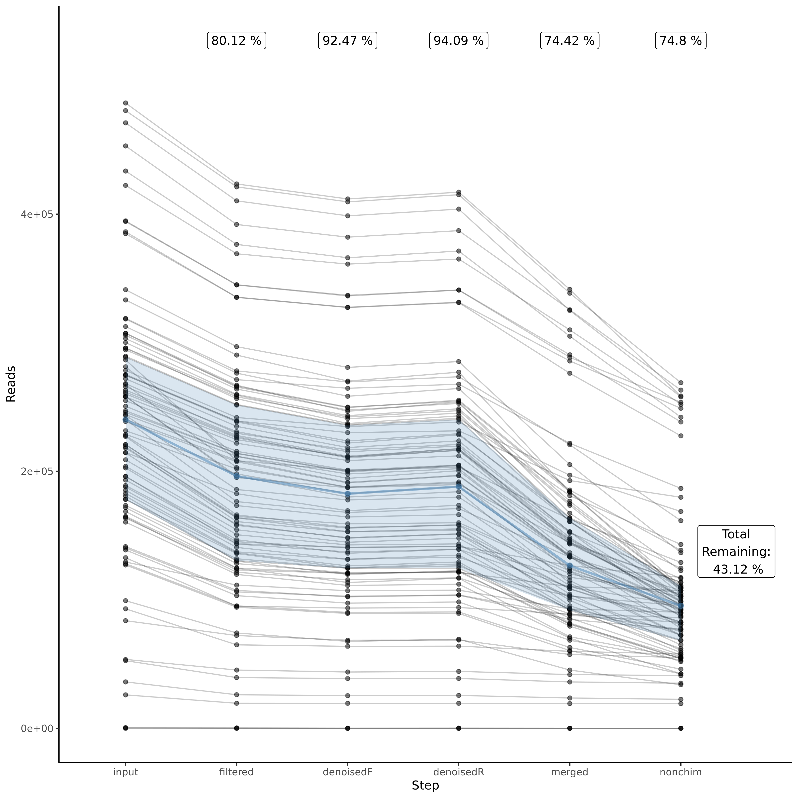

```{r include=FALSE}

knitr::opts_chunk$set(error=TRUE)
knitr::opts_chunk$set(eval = FALSE)
knitr::opts_chunk$set(echo = TRUE)

```


# Summary

This file aims to keep track of how microbiome samples from the plant-soil feedback (PSF) experiment were pre-processed. This document was mainly written by Marcela Aragon and Kris de Kreek but gathers tips and tricks given by Pedro Beschoren da Costa and Roland Berdager from WUR, as well as several online resources.

# Why doing this?

The reason for using a super computer or High Performance Computer -HPC for short- is that pre-processing of (lots of) microbiome samples requires high computational power which often is not available with normal PCs or laptops. Thus, to make it faster (and doable) we need to make use of an HPC. WUR has its own HPC which is called **"Anunna"**, people who run the HPC at WUR have made a [Wiki](https://wiki.anunna.wur.nl/index.php/Main_Page) available for users which contains a lot of information.

MiSeq data is usually pre-processed with the [Qiime2 pipeline](https://docs.qiime2.org/2022.8), for this, Pedro Beschoren has already adapted this Qiime2 workflow to be used in the HPC. If your samples were sequenced with MiSeq you can have a look at his [GitHub repository](https://github.com/PedroBeschoren/WUR_HPC_Annuna) instead.

If, however, your samples were sequenced with NovaSeq the story changes.

# Working in the HPC: Anunna

Making use of an HPC is tricky, as it works on **Linux** as an operating system and requires that you use a terminal/command line (**Shell**) with a completely new language to ask for what you want. As I understand, the HPC works with **Bash** which is just a type of command line interpreter (language) that runs in the Shell (?).

## Access to Anunna

Before going too technical, if you need to use Anunna from WUR, you first need to ask for access as there are costs involved with using it. To do this, you'll need to send an email to a staff member from Anunna stating that:

1.  you have permission from your manager/supervisor
2.  your WUR user account and,
3.  Your project number.


Always check the Anunna wiki (<https://wiki.anunna.wur.nl/index.php/Main_Page>) for more updated instructions.

```{bash eval=F, echo=T, error=T}

cd /lustre/nobackup/INDIVIDUAL/arago004 

```

## Entering the HPC

After you have received access to the HPC, you need to install software that can connect your computer to the HPC. There are multiple ways to do this. [PuTTY](https://putty.org/) is a software that can connect to a remote terminal to work on the HPC. When opening **PuTTY**, you have to specify the host name (login.anunna.wur.nl) and the Port 22 with connection type SSH. You can save your basic login settings. More information about this and other settings can be found on the [Annuna wiki](https://wiki.anunna.wur.nl/index.php/Log_in_to_Anunna). 


*[@Marcela, you use another way to enter the HPC right?]*

# Get prepared

If you are not familiar with bash, linux and using a super computer and you are also doing other things at the same time as I was let me tell you in advance that **this takes a lot of time: as in WEEKS!**. We really hope to help you making this time shorter with this guide, but still getting familiar with a new language and finding your way around the terminal will be a hassle. Also get prepared for some of your scripts to not run at the first time and to find that maybe after you've been waiting for some days your code had an error! We are telling you all this not to kill your hopes but on the contrary so you know that this is normal and for you to be mentally ready for the task ahead (both in spirit and in your time planning ;).

Having said that, you could start to get familiar with bash by practicing some of the most basic commands that you'll use.

## Linux commands

Before you can get started in the HPC, you need to get familiar with Bash. There are many tutorials on the internet that can help you with this *[Do we have some examples?]*. Furthermore, the staff members of Annuna offer some basic courses. I can recommend the **Linux Basic course** which is offered multiple times a year. There are also the **HPC Basic Course** and the **HPC Advanced Course**. I did not join these two last courses but they may be helpful as well. An overview of the upcoming courses can be found on the [Wiki](https://wiki.anunna.wur.nl/index.php/Main_Page#Events). 

There are some basic commands that you will use all the time. We will discuss them down here.

```{bash eval=F, echo=T, error=T}
ls # print a list with all files in the current directory
ll # print a long (elaborate) list with all files in the current directory
ls -l # other option for print a long (elaborate) list with all files in the current directory

cd Test/ # set the working directory to the directory "Test"
cd ../ # set the working directory one directory back

cat text.R # Print the R file in the console
nano text.R # Open the R file in a text editor

sbach test.slurm #running a slurm script (submit a job)
squeue -u kreek001 #check the status of the jobs you submitted
```

As you can see, you can add extra arguments to a command by using a '-' in front of a command. The help file of the command lists all the differed arguments that can be uses.

## File structure in the HPC
The structure of the HPC can be puzzling, and probably, I still do not fully understand it. From the root of the HPC, there are a bunch of folders of which we only need a few.
When you enter the HPC, you are in your home directory, for instance: '/home/WUR/kreek001'. The first '/' we call the root. Every user of the HPC does have its own home directory. 

*Tell about lustre and archive.*

## Moving files between the HPC and your local computer

## Checking differences in code

[Diffchecker]()

## Pimping your terminal

#Running the DADA2 (Ernakovich pipeline) for NovaSeq data

# 

# Running the pipeline

## 01_pre-processed

## 02_check-quality

## 03_filter_reads

## 04_learn_error_rates_dada2_tutorial_16S

Training and testing 4 different methods to distinguish between sequencing errors and biological differences. THIS is the reason why we are doing all this, because NovaSeq data "bins" error scores to just 4 categories instead of 40 like MiSeq, therefore it has less "resolution" (only 10%) to understand the "real" error rates (you have to "pay" this as you have more reads, otherwise it will be way too much information). There's not yet a standard solution to fix this, but it is clear that using the traditional way its not suitable **(see Fig. X)**, thus what Ernakovich lab does is to put together 4 different ways to learn error rates so you can choose, according to your data, which one is better (or less worse you can also say).

Because we don't fully understand it, we will not go into details of how and why these 4 error rates learning options are different. If you would like to know more you can check the explanation on their GitHub page and try to understand the different codes. What we believe is important is to realize that there are different ways to do it, and that which one is better to choose will depend **every time** entirely on your dataset. The way I see it is it's like checking your data distribution before you run a statistical test, sometimes is normal and sometimes is not and when it's not you have to select the appropriate data distribution so your statistical test has meaning.

Now, let's look at what changes we've made to the slurm and .R files:

**R**

```{r eval=F, echo=T}

```

**Slurm**


**Description about why these settings are changed**

After you run the `04_learn_error_rates_dada2_tutorial_16S.R` script you can find different plots that will show you how, according to each of the 4 options, your learned error rates (black dots and lines) match an expected value (red lines). You'll see that in any of the 4 options there's a perfect match but what Ernakovich's lab recommend is to check that your dots are somewhat close to your black lines and that this lines should decrease along the x-axis (see their better explanation for this).

You can find these plots on your `processed` folder --> `02_filter` --> `preprocessed_F` & `preprocessed_R` --> `filtered` (all the way down, after you've passed all your .gz sequences, **Fig. X**).


As you see, you'll have 2 plots per option per forward and reverse = 8 plots (+2 of traditional example just to compare). We suggest you to transfer them to you computer and paste them on some slides so you can compare between them on one go.

With my samples I got this output:

**Traditional way**


As you can see if I was to use the traditional way my results would be a bit crappy

**Option 1**


Doesn't look that bad

**Option 2**


It looks off --> not the one to choose

**Option 3**


Doesn't look that bad but Option 1 still looks better

**Option 4**


Also doesn't look that bad, so now it's between Option 1 and Option 4.

**Comparison between 1 and 4**


Honestly I can't see a difference between these 2 options, both of them go down across the x axis and points seem to be scattered in the same way across the black line. Looking at this **I will choose Option IV**, only for the reason of keeping it consistent with Pedro's choice for the Family Experiment (where half of my samples come from). This error rate learning option will be used on Script 05.

## 05_infer_ASVs_dada2_tutorial_16S

On this script you infer which reads belong to which ASV taking into account the error rates from step 04. Dada2 allows you to assign this by either pooling all your samples (`pool=TRUE`) or processing each sample independently (`pool=FALSE`), the difference between these 2 options are that pooling increases your "resolution" on rare taxa but requires much more computational time. As explained in the [dada2 site](https://benjjneb.github.io/dada2/pool.html), differences between these 2 options are \[in the example that they used\] less than 1% on the total number of ASVs. For this reason, we'll go without pooling and choose the fast method. If you are interested in rare taxa, consider changing to `pool=FALSE` setting.

Now, let's look at what changes we've made to the .R and .slurm files:

**R**

```{r eval=FALSE, include=TRUE}

# For each sample, get a list of merged and denoised sequences
for(sam in sample.names) {
  cat("Processing:", sam, "\n")
  # Dereplicate forward reads
  derepF <- derepFastq(filtFs[[sam]])
  # Infer sequences for forward reads
  dadaF <- dada(derepF, err = errF_4, multithread = TRUE) #here is where you change to Option 4 for F
  ddF[[sam]] <- dadaF
  # Dereplicate reverse reads
  derepR <- derepFastq(filtRs[[sam]])
  # Infer sequences for reverse reads
  dadaR <- dada(derepR, err = errR_4, multithread = TRUE) #here is where you change to Option 4 for R
  ddR[[sam]] <- dadaR
  # Merge reads together
  merger <- mergePairs(ddF[[sam]], derepF, ddR[[sam]], derepR)
  mergers[[sam]] <- merger
}
```

**slurm** Fig.X Settings for HPC to run script 05

**output** After sbatching this script and if everything goes well you should have in your `05_infer_ASVs_dada2_numberX.output` file something like this:


followed by a tail of this:


--> Now you are ready for Script 06!

## 06_remove_chimeras_dada2_tutorial_16S

Now comes the last script from the dada2-Ernakovich pipeline in which you will remove chimeras (and originally also asign the taxonomy to your ASV sequences). [Chimeras](https://en.wikipedia.org/wiki/Chimera_(molecular_biology)) are hybrid ASV sequences that are a by-product of the PCR amplification in which the extension step on ASV 'A' gets aborted and the resulting short aborted sequence is then used in the next cycle as a "primer" to amplify another ASV 'B'. The product of this is a 'ASV A-B' chimeric sequence, and you don't want those in your data as they are not real (but some sort of Frankestein ASV) and could take you to misleading results. Hence, in this part the pipeline looks for those chimeric sequences and removes them from your ASV table, for details check the [Ernakovich GitHub](**Missing%20link**) or [Dada2](**Missing%20link**) pipeline.

Originally, this script's name is `06_remove_chimeras_assign_taxonomy_dada2_tutorial_16S.R` as it also included a step in which you use a reference database to assign taxonomy to your ASV table. We will not do this as it was noticed by Pedro Beschoren and Roland Berdaguer that assigning taxonomy with dada2 `dada2::assignTaxonomy()` resulted in much more 'NAs' (taxonomy not assigned) than when using Qiime2 (classify-sklearn) instead. For this reason we'll keep this step 06 to just remove chimeras and get a final ASV table that we'll use later as input for step 07 in which we will assign taxonomy with Qiime2.

I ussed diffcheck to see [differences in the code](https://www.diffchecker.com/KLRB94HM) between Roland (removed taxonomy) and Pedro (extra filtering step) and renamed the files to remove the `assign_taxonomy` part from the title:

```{bash eval=F, echo=T}

#' In the R folder 
mv 06_remove_chimeras_assign_taxonomy_dada2_16S.R 06_remove_chimeras_dada2_16S.R


#' In the slurm folder
mv 06_remove_chimeras_assign_taxonomy_dada2_tutorial.slurm 06_remove_chimeras_dada2_tutorial.slurm


```

Be careful to adjust to the new name when necessary.

Part 04 removes chimeras and part 05 makes a summary of all the reads across the other scripts.

**R**

**All parts from assigning taxonomy were removed.**

An extra filtering step (Pedro Beschoren) was added so final object was not that heavy to handle locally in R studio

I included a step to save the taxonomy table without filtering first so we can compare it later:

```{r eval=F, echo=T}
# Write results to disk
saveRDS(seqtab.nochim, paste0(table.fp, "/seqtab_final_nofiltered.rds")) #save it so you see the difference in size 
```

Then added Pedro's filtering steps

```{r eval=F, echo=T}
# PEDRO'S ALTERATION: check number of columns (ASV) per rows (samples) of the original object and when reducing the number of ASVs by minimal abundance
# number of samplex X ASVs in full dataset, and then the same dataset by filtering more than 0, 1, 2, 3 occurences
dim(seqtab.nochim)
dim(seqtab.nochim[,colSums(seqtab.nochim)>0])
dim(seqtab.nochim[,colSums(seqtab.nochim)>1])
dim(seqtab.nochim[,colSums(seqtab.nochim)>2])
dim(seqtab.nochim[,colSums(seqtab.nochim)>3])

# PEDRO'S ALTERATION: overwrite the ASV table, removing ASVs that do not appear at least 3 times
# this is necessary because the original 'no_filtered' table might be too large to be processed by R in our local computers
# and anyhow you will need to make the same filtering of less than 3 occurrences per ASV after, so we better do it from now.
seqtab.nochim<-seqtab.nochim[,colSums(seqtab.nochim)>2]

# Write results to disk
saveRDS(seqtab.nochim, paste0(table.fp, "/seqtab_final.rds"))

```

Changed names inside of function and save only the repset in .fasta and .txt formats

```{r eval=F, echo=T}
# Write repset to fasta file
# create a function that writes fasta sequences
writeRepSetFasta<-function(data, filename){
  fastaLines = c()
  for (rowNum in 1:nrow(data)){
    fastaLines = c(fastaLines, as.character(paste(">", data[rowNum,"ASV_ID"], sep = ""))) #changed
    fastaLines = c(fastaLines,as.character(data[rowNum,"ASV"])) #changed
  }
  fileConn<-file(filename)
  writeLines(fastaLines, fileConn)
  close(fileConn)
}

# write repset to fasta file
writeRepSetFasta(rep_set_ASVs, paste0(table.fp, "/repset.fasta"))

# Also export files as .txt
write.table(seqtab.t, file = paste0(table.fp, "/seqtab_final.txt"),
            sep = "\t", row.names = TRUE, col.names = NA)

```

**slurm**


**output**

For my samples it took about \~2 hours to run,

In my `06_remove_chimeras_dada2_###.output` file I had something like this at the beginning:


that finished with this:


I found strange that in denoised F and denoised R I have `0`, so I check the `tracking_reads_summary_plot.png` file and saw that something must have gone wrong after the filtering step!!



After trying several things I realized that the process was okay & I didn't have 0 reads at the end but the 'Sample' names were not the same for all dataframes that were joined so I had to modify a bit again the script to:

```{r eval=F, echo=T}

# tracking reads by counts
filt_out_track <- filt_out %>%
  data.frame() %>%
  mutate(Sample = gsub("_R1.fastq.gz","",rownames(.))) %>% #changed to avoid mistake
  rename(input = reads.in, filtered = reads.out)
rownames(filt_out_track) <- filt_out_track$Sample


```

Be careful to change in between the "" with how your files are ending!!

After doing this, then I get this new `tracking_reads_summary_plot.png`:



It looks like something went wrong in the 'Merging' step as the number of reads drop about 20%. ***This needs to be checked***

STILL NEED TO GO BACK AND CHECK 'MERGE PAIRED READS' STEP from DADA2!! ([\<https://benjjneb.github.io/dada2/tutorial.html>](https://benjjneb.github.io/dada2/tutorial.html){.uri})

## 07_Assigning taxonomies to ASVs

As mentioned before we will now assign taxonomy to each of our ASVs according to the [SILVA rRNA database](https://www.arb-silva.de/) which is a huge database that matches taxonomy with the sequence of the small subunit of ribosomal RNA (16S/18S). This step will be a bit different of what we've been doing as it will not run in R but in Qiime2.

[Qiime2](https://docs.qiime2.org/2022.8/about/) is a streamlined pipeline used to analyze microbiome data. It takes you from the very start (raw reads) and it finishes with multiple options of statistical analysis and visualizations. For another explanation/summary of Qiime2, you can visit this tutorial: [https://hackmd.io/\@MAE-MBL/HylpoaOF5#Bioinformatics-III-qiime2](https://hackmd.io/@MAE-MBL/HylpoaOF5#Bioinformatics-III-qiime2){.uri} that I find easier to follow than the original one. One of the steps of the Qiime2 pipeline is, of course, to assign taxonomy to ASVs according to a (*trained*) database.

I highlight the word *trained* as this is an **extra step** that you will have to do in case you didn't use the same primers we did (see table below) for your 16S/ITS regions. In a nutshell, training means that you keep only the region of your interest so the SILVA database can assign taxonomy with more accuracy.If you need to train your classifier, please follow [this tutorial to train your SILVA database with RESCRIPt](https://forum.qiime2.org/t/processing-filtering-and-evaluating-the-silva-database-and-other-reference-sequence-data-with-rescript/15494).

+-----------+-----------+-------------------------+-----------+--------------------------+
|           | 16S       | 16S                     | ITS       | ITS                      |
+===========+:=========:+:=======================:+:=========:+:========================:+
|           | Region    |                         | Region    |                          |
+-----------+-----------+-------------------------+-----------+--------------------------+
| Forward   | 341f      | "CCTACGGGNGGCWGCAG"     | ITS1F     | "CTTGGTCATTTAGAGGAAGTAA" |
+-----------+-----------+-------------------------+-----------+--------------------------+
| Reverse   | 805r      | "GACTACHVGGGTATCTAATCC" | ITS2R     | "GCTGCGTTCTTCATCGATGC"   |
+-----------+-----------+-------------------------+-----------+--------------------------+

: Set of 16S and ITS primers used

As I'm using the same primers to amplify the V3-V4 16S region that both Pedro and Roland used, I can use the same already-trained SILVA database that they used and skip the training step.

To run Qiime2 you need to [install it, and activate within a conda environment inside the HPC](https://docs.qiime2.org/2022.8/install/native/#install-qiime-2-within-a-conda-environment) if you don't have it already installed. The instructions are straightforward, but most likely this step will take you time as you'll have to wait some time for conda and plug-ins to get downloaded (so take it into account).

Once installed, you'll have to run script 07 which it will be the actual script that you'll run directly with *sbatch* (not like the previous R scripts)

**slurm**

```{bash eval=F, echo=T}

#!/bin/bash -login

#SBATCH --time=16:00:00                                 ### limit of wall clock time - how long the job will run (same as -t)
#SBATCH --ntasks=1                                            ### number of tasks - how many tasks (nodes) that you require (same as -n)
#SBATCH --cpus-per-task=16                        ### number of CPUs (or cores) per task (same as -c)
#SBATCH --mem=64G                                               ### memory required per node - amount of memory (in bytes)
#SBATCH --job-name="07_assing_taxonomy_sklearn"                 ### you can give your job a name for easier identification (same as -J)
#SBATCH --output="07_assign_taxonomy_sklearn_%j.output"

# activates qiime2 environment
conda activate qiime2-2022.8

# imports representative sequences in FASTA format
qiime tools import \
  --input-path /lustre/nobackup/INDIVIDUAL/arago004/ernakovichlab_pipeline/16S_processed_MA/03_tabletax/repset.fasta \
  --output-path /lustre/nobackup/INDIVIDUAL/arago004/ernakovichlab_pipeline/16S_processed_MA/03_tabletax/rep-seqs_16S.qza \
  --type 'FeatureData[Sequence]'


# assing taxonomy ranks on your representative sequences, based on the trained SILVA reference
qiime feature-classifier classify-sklearn \
  --i-classifier /lustre/nobackup/INDIVIDUAL/arago004/ernakovichlab_pipeline/silva-138.1-ssu-nr99-341f-805r-classifier.qza \
  --i-reads /lustre/nobackup/INDIVIDUAL/arago004/ernakovichlab_pipeline/16S_processed_MA/03_tabletax/rep-seqs_16S.qza \
  --o-classification /lustre/nobackup/INDIVIDUAL/arago004/ernakovichlab_pipeline/16S_processed_MA/03_tabletax/taxonomy_16S.qza


# Export the taxonomy from the .qza taxonomy assingment trained with the correct priemr set, it also crates a new folder in the process
qiime tools export \
--input-path /lustre/nobackup/INDIVIDUAL/arago004/ernakovichlab_pipeline/16S_processed_MA/03_tabletax/taxonomy_16S.qza \
--output-path /lustre/nobackup/INDIVIDUAL/arago004/ernakovichlab_pipeline/16S_processed_MA/03_tabletax/16S_sklearn_taxonomy

conda deactivate

```

**output**

the `07_assign_taxonomy_sklearn_#.output` file should contain just a couple of lines letting you know that all the steps you asked for were made:

```{bash eval=F, echo=T}

Imported /lustre/nobackup/INDIVIDUAL/arago004/ernakovichlab_pipeline/16S_processed_MA/03_tabletax/repset.fasta as DNASequencesDirectoryFormat to /lustre/nobackup/INDIVIDUAL/arago004/ernakovichlab_pipeline/16S_processed_MA/03_tabletax/re$Saved FeatureData[Taxonomy] to: /lustre/nobackup/INDIVIDUAL/arago004/ernakovichlab_pipeline/16S_processed_MA/03_tabletax/taxonomy_16S.qza
Exported /lustre/nobackup/INDIVIDUAL/arago004/ernakovichlab_pipeline/16S_processed_MA/03_tabletax/taxonomy_16S.qza as TSVTaxonomyDirectoryFormat to directory /lustre/nobackup/INDIVIDUAL/arago004/ernakovichlab_pipeline/16S_processes/03_t$

```


And that's it, you've made it! Now you are ready to import your data to R. The files that you will need are inside of the 03.Taxonomy folder and are:

* The `seqtab_final.txt` --> that will be your OTU table (otu_table)
* `repset.fasta` --> that will be the DNA sequences for each ASV (refseq)
* `taxonomy.tsv` --> that will be your the taxonomy table (tax_table)

* and your **metadata** file, in my case `Mapping_file_16S_Family_experiment.txt` that will be your metadata (sample_data) 


Finally, transfer these 4 files to your local computer and think about whether you would like to re-name them so their title is a bit more informative. For instance to track back that were for 16S and not ITS ;)


## 08_Importing data to R


