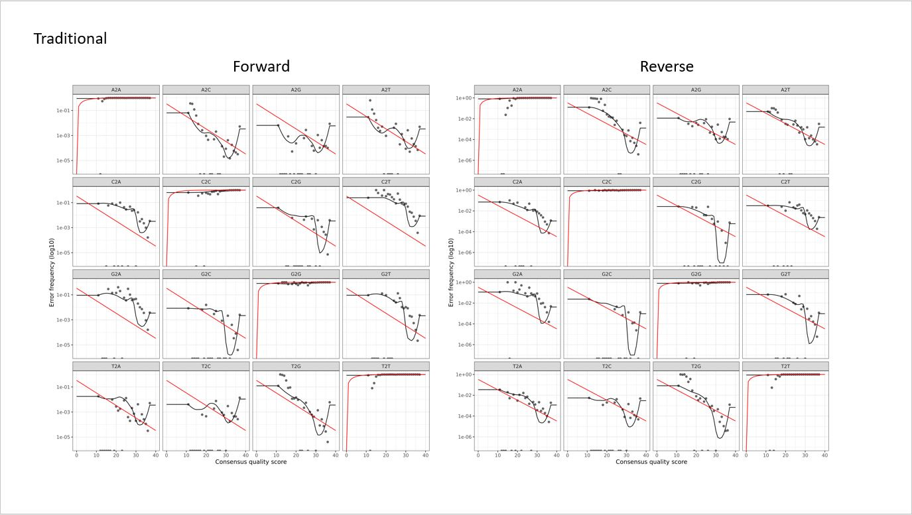
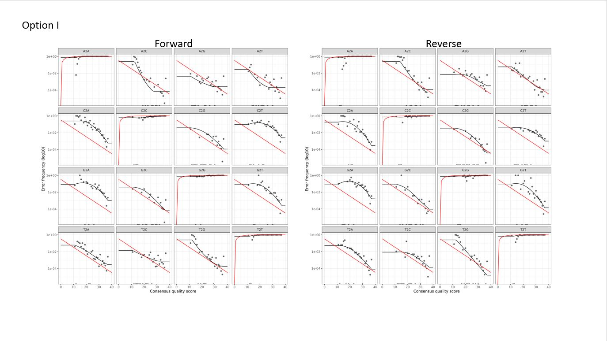

# Summary
This file aims to keep track of how microbiome samples from the PSF experiment were pre-processed. 


# Why doing this? 

The reason for using a super computer or High Performance Computer -HPC for short- is that pre-processing of (lots of) microbiome samples requires high computational power which often is not available with normal PCs or laptops. Thus, to make it faster (and doable) we need to make use of an HPC. WUR has its own HPC which is called **"Anunna"**, people who run the HPC at WUR have made a [Wiki][https://wiki.anunna.wur.nl/index.php/Main_Page] available for users which contains a lot of information.  

MiSeq data is usually pre-processed with the [Qiime2 pipeline ][https://docs.qiime2.org/2022.8/], for this, Pedro Beschoren has already adapted this Qiime2 workflow to be used in the HPC. If your samples were sequenced with MiSeq you can have a look at his [GitHub repository][https://github.com/PedroBeschoren/WUR_HPC_Annuna] instead.

If, however, your samples were sequenced with NovaSeq the story changes. 


# Get prepared

If you are not familiar with bash, linux and using a super computer and you are also doing other things at the same time as I was let me tell you in advance that **this takes a lot of time: as in WEEKS!**. We really hope to help you making this time shorter with this guide, but still getting familiar with a new language and finding your way around the terminal will be a hassle. Also get prepared for some of your scripts to not run at the first time and to find that maybe after you've been waiting for some days your code had an error! We are telling you all this not to kill your hopes but on the contrary so you know that this is normal and for you to be mentally ready for the task ahead (both in spirit and in your time planning ;).  

Having said that, you could start to get familiar with bash by practicing some of the most basic commands that you'll use. 


# Working in the HPC: Anunna 

Making use of an HPC is tricky, as it works on **Linux** as an operating system and requires that you use a terminal/command line (**Shell**) with a completely new language to ask for what you want. As I understand, the HPC works with **Bash** which is just a type of command line interpreter (language) that runs in the Shell (?).

## Access to Anunna 

Before going too technical, if you need to use Anunna from WUR you first need to ask for access as there are costs involved with using it. To do this you'll need to send an email to a staff member from Anunna stating that:

1. you have permission from your manager/supervisor
2. your WUR user account and,
3. Your project number.


Always check the Anunna wiki (https://wiki.anunna.wur.nl/index.php/Main_Page) for more updated instructions.


```{bash eval=FALSE}

cd /lustre/nobackup/INDIVIDUAL/arago004 

```

#Running Ernakovich pipeline for NovaSeq data

#

#


## 01_pre-processed 

## 02_check-quality 

## 03_filter_reads 

## 04_learn_error_rates_dada2_tutorial_16S

Training and testing 4 different methods to distinguish between sequencing errors and biological differences. THIS is the reason why we are doing all this, because NovaSeq data "bins" error scores to just 4 categories instead of 40 like MiSeq, therefore it has less "resolution" (only 10%) to understand the "real" error rates (you have to "pay" this as you have more reads, otherwise it will be way too much information). There's not yet a standard solution to fix this, but it is clear that using the traditional way its not suitable **(see Fig. X)**, thus what Ernakovich lab does is to put together 4 different ways to learn error rates so you can choose, according to your data, which one is better (or less worse you can also say). 

Because we don't fully understand it, we will not go into details of how and why these 4 error rates learning options are different. If you would like to know more you can check the explanation on their GitHub page and try to understand the different codes. What we believe is important is to realize that there are different ways to do it, and that which one is better to choose will depend **every time** entirely on your dataset. The way I see it is it's like checking your data distribution before you run a statistical test, sometimes is normal and sometimes is not and when it's not you have to select the appropriate data distribution so your statistical test has meaning. 


Now, let's look at what changes we've made to the slurm and .R files:

**R**

```{r}

```


**Slurm**


**Description about why these settings are changed**


After you run the `04_learn_error_rates_dada2_tutorial_16S.R` script you can find different plots that will show you how, according to each of the 4 options, your learned error rates (black dots and lines) match an expected value (red lines). You'll see that in any of the 4 options there's a perfect match but what Ernakovich's lab recommend is to check that your dots are somewhat close to your black lines and that this lines should decrease along the x-axis (see their better explanation for this). 

You can find these plots on your `processed` folder --> `02_filter` --> `preprocessed_F` & `preprocessed_R` --> `filtered` (all the way down, after you've passed all your .gz sequences, **Fig. X**). 


As you see, you'll have 2 plots per option per forward and reverse = 8 plots (+2 of traditional example just to compare). We suggest you to transfer them to you computer and paste them on some slides so you can compare between them on one go. 

With my samples I got this output:

**Traditional way**



As you can see if I was to use the traditional way my results would be a bit crappy

**Option 1**



Doesn't look that bad

**Option 2**


It looks off --> not the one to choose

**Option 3**


Doesn't look that bad but Option 1 still looks better 

**Option 4**


Also doesn't look that bad, so now it's between Option 1 and Option 4. 

**Comparison between 1 and 4**


Honestly I can't see a difference between these 2 options, both of them go down across the x axis and points seem to be scattered in the same way across the black line. Looking at this **I will choose Option IV**, only for the reason of keeping it consistent with Pedro's choice for the Family Experiment (where half of my samples come from). This error rate learning option will be used on Script 05. 


## 05_infer_ASVs_dada2_tutorial_16S

On this script you infer which reads belong to which ASV taking into account the error rates from step 04. Dada2 allows you to assign this by either pooling all your samples (`pool=TRUE`) or processing each sample independently (`pool=FALSE`), the difference between these 2 options are that pooling increases your "resolution" on rare taxa but requires much more computational time. As explained in the [dada2 site](https://benjjneb.github.io/dada2/pool.html), differences between these 2 options are [in the example that they used] less than 1% on the total number of ASVs. For this reason, we'll go without pooling and choose the fast method. If you are interested in rare taxa, consider changing to `pool=FALSE` setting.   


Now, let's look at what changes we've made to the .R and .slurm files:

**R**

```{r eval=FALSE, include=TRUE}

# For each sample, get a list of merged and denoised sequences
for(sam in sample.names) {
  cat("Processing:", sam, "\n")
  # Dereplicate forward reads
  derepF <- derepFastq(filtFs[[sam]])
  # Infer sequences for forward reads
  dadaF <- dada(derepF, err = errF_4, multithread = TRUE) #here is where you change to Option 4 for F
  ddF[[sam]] <- dadaF
  # Dereplicate reverse reads
  derepR <- derepFastq(filtRs[[sam]])
  # Infer sequences for reverse reads
  dadaR <- dada(derepR, err = errR_4, multithread = TRUE) #here is where you change to Option 4 for R
  ddR[[sam]] <- dadaR
  # Merge reads together
  merger <- mergePairs(ddF[[sam]], derepF, ddR[[sam]], derepR)
  mergers[[sam]] <- merger
}
```


**slurm**


After sbatching this script and if everything goes well you should have in your `05_infer_ASVs_dada2_numberX.output` file something like this:


followed by a tail of this:


--> Now you are ready for Script 06!


## 06_remove_chimeras_assign_taxonomy_dada2_tutorial_16S

Now comes the part in which you have to remove chimeras and assign taxonomy to your ASVs according to a database (Step 3 in the [Ernakovich pipeline](https://github.com/ErnakovichLab/dada2_ernakovichlab)). For this we use the [SILVA rRNA database](https://www.arb-silva.de/) which is a huge database that matches taxonomy with the sequence of the small subunit of ribosomal RNA (16S/18S). You'll have to download the most updated database file from the SILVA webpage, in the section called "arb files" (https://www.arb-silva.de/download/arb-files/). In our case we ended up with a downloaded file in named `SILVA_138.1_SSURef_NR99_12_06_20_opt.arb.gz` stored in our local computer.


After the download you'll need to transfer the file to the terminal using Filezilla as we explained before in **Section X**. The file is large, so it takes about ~3 minutes for it to be transfered. Be wary of where you store the  file in your HPC directory as you'll need to specify the path later on in R script file. Before doing that, as now it's a `.qz` file you'll need to decompress it to a `.fa` file. 


## 07_Adding phylogenetic tree 


