# Summary

This file aims to keep track of how microbiome samples from the plant-soil feedback (PSF) experiment were pre-processed. This document was mainly written by Marcela Aragón and Kris de Kreek but gathers tips and tricks given by Pedro Beschoren da Costa and Roland Berdager from WUR, as well as several online resources.

# Why doing this?

The reason for using a super computer or High Performance Computer -HPC for short- is that pre-processing of (lots of) microbiome samples requires high computational power which often is not available with normal PCs or laptops. Thus, to make it faster (and doable) we need to make use of an HPC. WUR has its own HPC which is called **"Anunna"**, people who run the HPC at WUR have made a [Wiki](https://wiki.anunna.wur.nl/index.php/Main_Page) available for users which contains a lot of information.

MiSeq data is usually pre-processed with the [Qiime2 pipeline](https://docs.qiime2.org/2022.8), for this, Pedro Beschoren has already adapted this Qiime2 workflow to be used in the HPC. If your samples were sequenced with MiSeq you can have a look at his [GitHub repository](https://github.com/PedroBeschoren/WUR_HPC_Annuna) instead.

If, however, your samples were sequenced with NovaSeq the story changes.

# Working in the HPC: Anunna

Making use of an HPC is tricky, as it works on **Linux** as an operating system and requires that you use a terminal/command line (**Shell**) with a completely new language to ask for what you want. As I understand, the HPC works with **Bash** which is just a type of command line interpreter (language) that runs in the Shell. See this small [introduction of the Unix Shell](https://swcarpentry.github.io/shell-novice/index.html) if you want to know more 

## Access to Anunna

Before going too technical, if you need to use Anunna from WUR, you first need to ask for access as there are costs involved with using it. To do this, you'll need to send an email to a staff member from Anunna (Fig. 1) stating that:

1.  you have permission from your manager/supervisor
2.  your WUR user account and,
3.  Your project number.

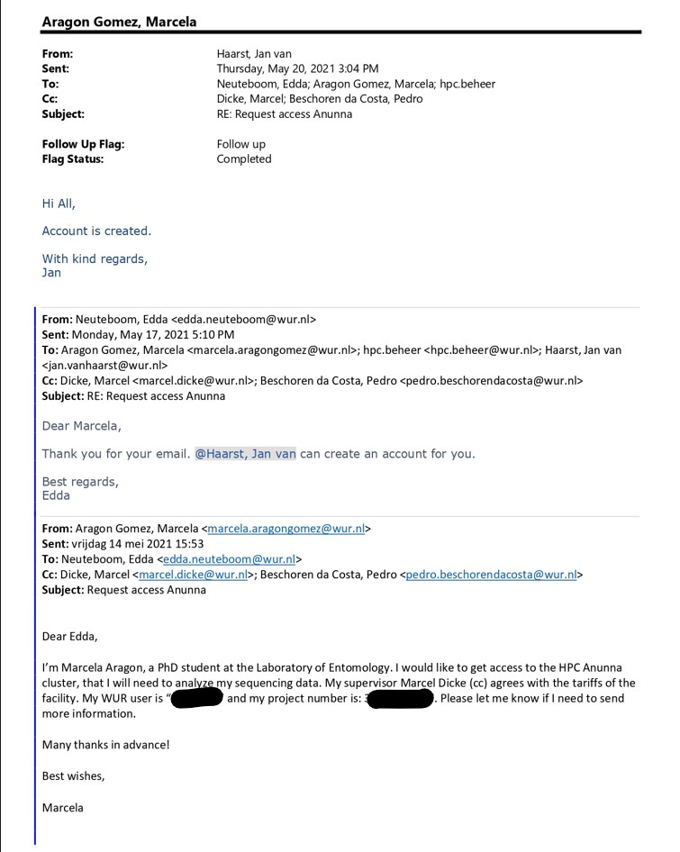

Always check the Anunna wiki (<https://wiki.anunna.wur.nl/index.php/Main_Page>) for more updated instructions.


## Entering the HPC

There are many options to access the HPC, we will explain the 2 that we know of and that have worked for us: 1. Using PuTTY (Kris) and 2. Using Ubuntu (Marcela).

### 1.With PuTTY

After you have received access to the HPC, you need to install software that can connect your computer to the HPC. There are multiple ways to do this. [PuTTY](https://putty.org/) is a software that can connect to a remote terminal to work on the HPC. When opening **PuTTY**, you have to specify the host name (login.anunna.wur.nl) and the Port 22 with connection type SSH (Fig. 2). You can save your basic login settings. More information about this and other settings can be found on the [Annuna wiki](https://wiki.anunna.wur.nl/index.php/Log_in_to_Anunna). 
   
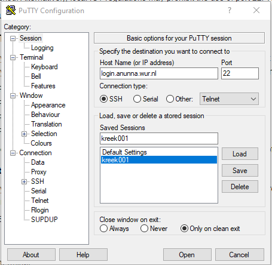
   
You will have to type your password When entering the HPC. Your password is not visible (not even dots). This may be confusing. After this step, you are ready to use the HPC!  

### 2.With Ubuntu 

You can also install a complete Ubuntu terminal environment in your Windows (Windows Subsystem for Linux (WSL)), and use this terminal to access the HPC. You'll need to download the [**Ubuntu for Windows** app](https://apps.microsoft.com/store/detail/ubuntu-on-windows/9NBLGGH4MSV6?hl=nl-nl&gl=nl&rtc=1) 

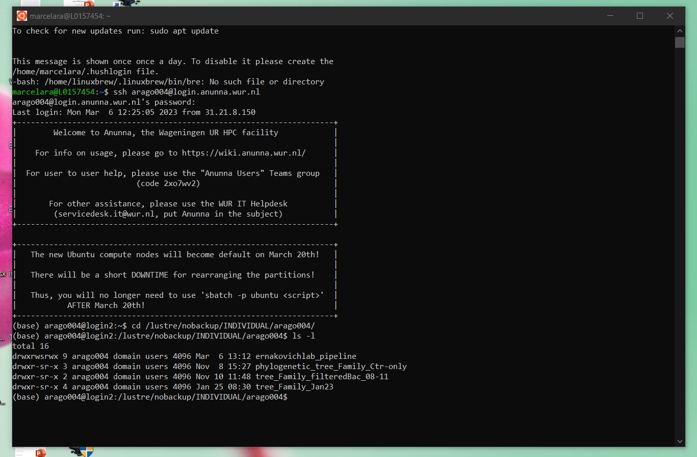
You access Anunna with the command:


``` bash

ssh arago004@login.anunna.wur.nl 

```

And afterwards type your password and press `Enter`, same as with PuTTY you will not see your password written. 


# Get prepared

If you are not familiar with bash, linux and using a super computer and you are also doing other things at the same time as I was let me tell you in advance that **this takes a lot of time: as in WEEKS!**. We really hope to help you making this time shorter with this guide, but still getting familiar with a new language and finding your way around the terminal will be a hassle. Also get prepared for some of your scripts to not run at the first time and to find that maybe after you've been waiting for some days your code had an error! We are telling you all this not to kill your hopes but on the contrary so you know that this is normal and for you to be mentally ready for the task ahead (both in spirit and in your time planning ;).

Having said that, you could start to get familiar with bash by practicing some of the most basic commands that you'll use.

## Linux commands

Before you can get started in the HPC, you need to get familiar with Bash. There are many [tutorials](https://ubuntu.com/tutorials/command-line-for-beginners#1-overview) on the internet that can help you with this. Furthermore, the staff members of Annuna offer some basic courses. I can recommend the **Linux Basic course** which is offered multiple times a year. There are also the **HPC Basic Course** and the **HPC Advanced Course**. I did not join these two last courses but they may be helpful as well. An overview of the upcoming courses can be found on the [Wiki](https://wiki.anunna.wur.nl/index.php/Main_Page#Events). 

There are some basic commands that you will use all the time. We will discuss them down here.


``` bash
ls    # print a list with all files in the current directory
ll    # print a long (elaborate) list with all files in the current directory
ls -l # other option for print a long (elaborate) list with all files in the current directory

cd Test/ # set the working directory to the directory "Test"
cd ../   # set the working directory one directory back

cat text.R         # Print the R script in the console
zcat text.fastq.qz # Print the compressed (zipped) file in the console
nano text.R        # Open the R script in a text editor
head text.R        # Print the head of the R script in the console

mv text.R /RScripts/ # move the R script to the directory RScripts that is existing the current directory
cp text.R /RScripts/ # copy the R script to the directory RScripts that is existing the current directory
mv text.R script1.R  # rename a the R script

sbach test1.slurm  #running a slurm script (submit a job)
squeue -u kreek001 #check the status of the jobs you submitted
```

As you can see, you can add extra arguments to a command by using a `-` in front of a command. The help file of the command lists all the differed arguments that can be uses.

There are some very handy keys that will accelerate coding in Linux. Like in R, the name of a function, directory or file can be completed by pressing `tab` when typing the first few letters. When there are multiple options, i.e. multiple folder start with these same letters, you can show all options by pressing `tab` twice.   
Furthermore, you may sometimes print a file in the console that is very large. You can stop the printing by pressing `CTRL C`.    

Many, many things are possible in Linux. So Google is your friend when you want to do something and you do not know the commands to do it. Here's a link to a [cheat sheet of the most common used Linux commands](https://www.guru99.com/linux-commands-cheat-sheet.html) 


## File structure of the HPC

The structure of the HPC can be puzzling. From the root of the HPC, there are a bunch of folders of which we only need a few.
When you enter the HPC, you are in your home directory, for instance: `/home/WUR/kreek001`. The first `/` we call the root, so your home directory is a directory in the `WUR` directory and that directory is a directory in the `home` directory in the root of the HPC. Every user of the HPC does have its own home directory. To be honest, you will not use your home directory much. You will use two other directories in the root of the HPC: `lustre` and `archive` (Fig. 4). 

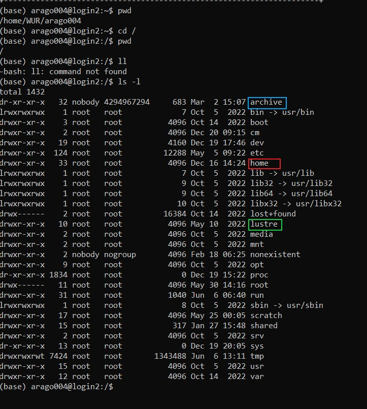

You will use your `lustre` directory as your own 'working directory' where you will store your data and scripts you are working with at that moment. From  here, you can submit jobs to the HPC. The file path to get to your own `lustre` directory will be similar to this: `/lustre/nobackup/INDIVIDUAL/kreek001/`. As there is no shared directory from the Plant science group, you will have a shared directory in `INDIVIDUAL` (Fig. 5).

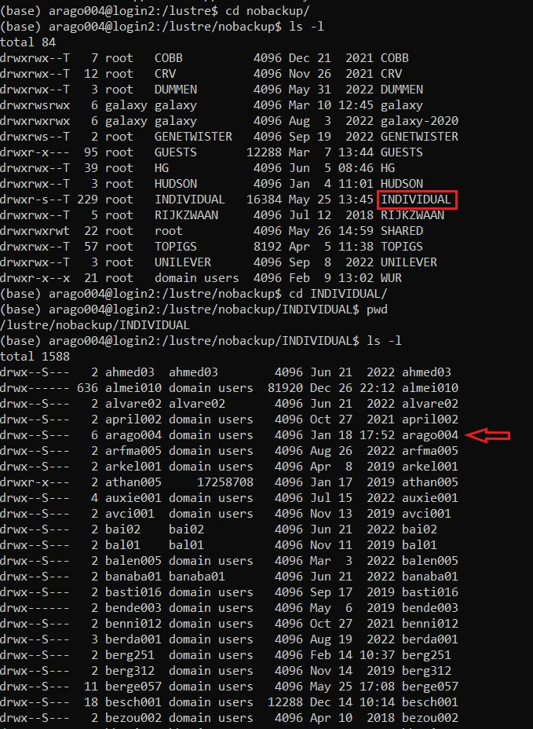


`archive` is mostly used for storing a backup of your data and data and scripts from `lustre` on which you do not work anymore. After finishing a project on `lustre`, it is wise to move all you files to `archive` as there is limited storage capacity on `lustre`. The file path to there will be similar to this: `/archive/INDIVIDUAL/kreek001/`.

Try yourself navigating through the directories of the HPC using de `cd` and `ls -l` commands to get familiar with it.


## Moving files between the HPC and your local computer

The easiest way to move files between your local computer and the HPC is via an FTP client like [FileZilla](https://en.wikipedia.org/wiki/FileZilla) or [WinSCP](https://winscp.net/eng/index.php?). After downloading and opening the FTP client software you will have to login with the credentials you use for the HPC and then see at least two windows; one with your local computer files and one with the files in the HPC. The files of you local computer are shown in the middle on the right in the case of FileZilla and to the right in the case of WinSCP. You can transfer files between these two platforms just by dragging them.

_Example with FileZilla_
Go to File > Site manager. Click on New site. You need `SFTP - SSH File Transfer Protocol` and the `login.annuna.wur.nl` as host. You can fill out your own username and pass word. Click on Connect and you will connect to the HPC (Fig. 6). These settings are stored and you can connect to the HPC the next time via the Site manager without filling out the settings again.

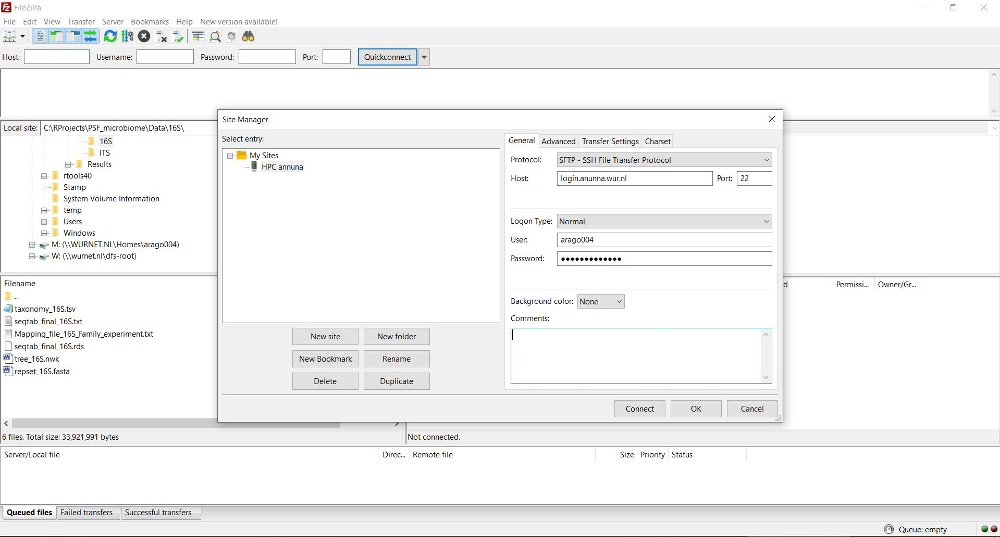

Now, you can drag and drop files from the HPC to your local computer and the other way around. Files will also be transferred when you double click on a file. When yo want to just open a file, click with the right mouse button on a file and chose View/Edit, in this way you can edit .R scripts directly in R Studio for instance.

It can take a while to navigate through the directories of the HPC to get into the right folder as it may take a while before the folder is loaded. You can make bookmarks of frequently used directories, such as your lustre folder, to reduce the navigation time. You can do this at the drop down menu bookmarks.


## Checking differences in code

To double-check if your code is correct, or what is the difference between one script and other, you can use this
[Diffchecker](https://www.diffchecker.com/text-compare/) tool (Fig 7). This is quite handy if you are recycling code from somebody else and want to know very quickly what is the difference between the old and the new version.

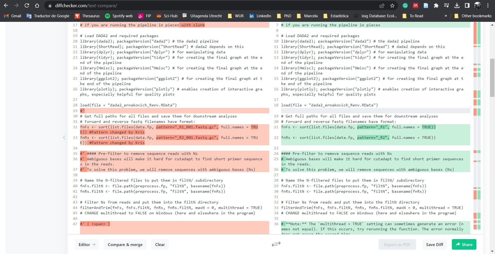

## Pimping your terminal

Your slurm and R scripts are edited in [Nano](https://linuxize.com/post/how-to-use-nano-text-editor/), a command line text editor. You will not be able to use Ctrl+C, Ctrl+V nor to click to move around the script, so to make your life easier and be able to distinguish the different parts of your script you can opt to modify the syntax highlighting rules so you can get different colors (Fig. 8), in my experience it really helps to detect mistakes faster than having only the black screen with white font!

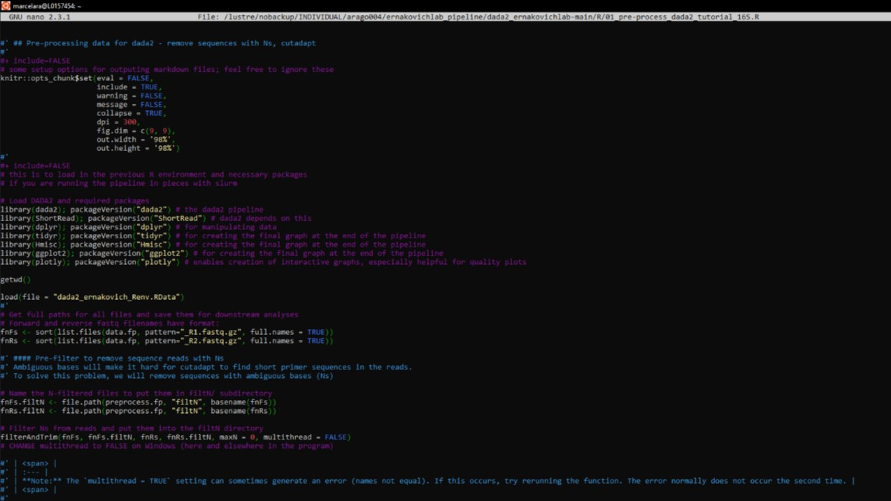

Watch this [YouTube video](https://www.youtube.com/watch?v=BSM4ATQdYF0) with instructions and use this code (https://gist.github.com/benjamin-chan/4ef37955eabf5fa8b9e70053c80b7d76) in your .nanorc file.


# Downloading data

So you've received your data, and now what? Usually, the sequencing company will provide you the information for downloading the data from their remote server to the HPC. We'll show you the two ways we've experienced according to the sequencing company; 1.Genome Quebec or 2.Novogene

## Version 1: Genome Quebec

This is an example of the email we received from Genome Quebec:


``` r
# Dear Pedro,
# your 16S/ITS metabarcoding data (internal ID2577) is ready for download (delivery_20220922) via:
# web-app: http://support.igatech.it/delivery
# or
# SFTP: support.igatech.it (command line or using an FTP client such as FileZilla or WinSCP)
# by using
# Username : beschoren-da-costa_pedro
# Password : xxexamplexx
```

As the email stats, there are two options to access the data, directly from the HPC with Bash commands or via a FTP client like [FileZilla](https://filezilla-project.org/). The first option may be a bit more exciting wile the second one is a bit more intuitive. I would advice to store a copy of the data on the archive and on lustre. And make a backup of the data on an external hard drive to have an extra copy, just in case.

**Downloading data with Bash commands**

So, you go to the folder on the HPC where you want to store the data. First, you need to connect to the remote server of the sequencing company. The email states that you can do this via `SFTP`. After some googling, we found a [tutorial](https://linuxize.com/post/how-to-use-linux-sftp-command-to-transfer-files/) to explain how to do this. In short you first access the server of the sequencing company with the information provided in the email:


``` bash
sftp beschoren-da-costa_pedro@support.igatech.it
```

After that, you can navigate through the directories and you should see the same files as when you open the internet link in the email. After that you can use the `get` command to download the data. The `-r` argument is used to specify that you want to download a directory.


``` bash
sftp get -r remote_directory
```

You can read the tutorial for more information.

**Dowloading data with FileZilla**

Just like you connected to the HPC in FileZilla, you can connect to the remote sever of the sequencing company. So go to the Site manager, click on New site and fill out the open fields like for instance:


``` r
#	Protocol: SFTP
#	Host: support.igatech.it
#	Port: 22 (provided by igatch)
#	Inlogtype: normal
#	Username: beschoren-da-costa_pedro
#	Password:
```

Next, you can download the data to and external hard drive and the HPC.

## Version 2: Novogene

**Downloading data with Bash commands** 

In the case of **Novogene** you only receive an email that states that your data is ready with a new BatchID number and password along with a link (Fig. 9).Once in the portal, you can batch download all the files directly in the HPC by first selecting all of them and clicking on 'Export Link' which will make a .csv file with the links to all of the files (Fig. 10). You will copy this .csv file to a new directory in the HPC (in your archive or lustre directly) and then from that directory just run one line, after that you'll have all of your files downloaded.


``` bash

#Batch download using Wget
#1. click the “Export Link” button to export all links
#2. Use wget -i ./X204SC24032638-Z01-F003.csv to batch downloads

wget -i thenameofyourcsvfile.csv 

```

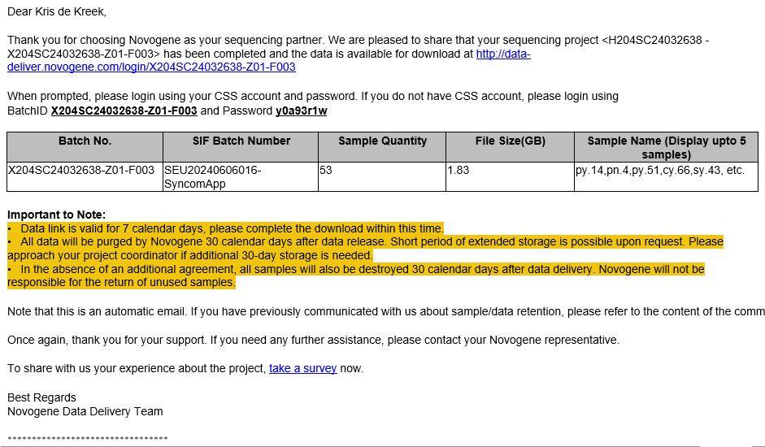


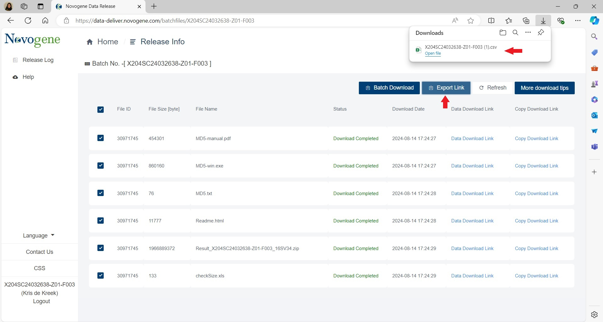

Now you only have to unzip the .zip file containing your raw data with a single line as well;

``` bash

cd thenameofthedirectorywherethezipfileis

unzip thenameofyourzipfile.zip

```

Now your data is unziped and ready to be processed, just in case don't forget to store the data in another place such as your W drive or a hard drive.

# Checking download with checksums

We would like to know whether all files are downloaded well. We can compare this by comparing the checksums of the files with sequencing data before and after downloading. A checksum is a unique code of a file. This code does not change when the file is downloaded correctly. The sequencing company will provide a file with the checksums of all files. Such a file is called a md5file. After downloading, you can make your own md5file and compare the two. Go to the directory with your sequencing data files and do the following:


``` bash
md5sum * > filename
```

The `*` means you want to target all files and store the checksums in the file called `filename`. 

Next, copy the checksums and file of the md5file before and after downloading into two different Excel sheets. Order the file names both sheets in the same way. Next, copy the check sums and file names of one sheet next to the file names and check sums of the other sheet and lat Excel compare the checksums. For instance, when the checksums of the sequencing company are in column A and the checksums after downloading are in column D, you can type in column F `=A1=D1`. Excel will print `TRUE` when the checksums are the same and `FALSE` when they are not (Fig. 9). You can use a function to count the number of False. This number should be 0.

I use these formula in Excel to determine whether the name in column A equals the name of column D. And I count the number of trues and falses;

=A2=D2

=COUNTIF(F2:F1681, "TRUE")

=COUNTIF(F3:F1682, "FALSE")


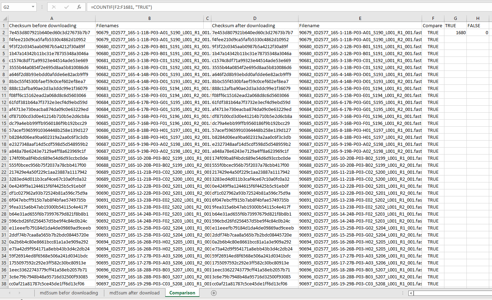

*Figure 9. Show of screen shot of the Excel file*

# Separating/finding files

It can happen that samples of multiple of your experiments are sequenced at once. In that case, you have to separate the sequence data of the experiments before doing the analysis. It is wise to backup your data before doing this. Regular expressions can be used to select the files of one experiment. A very nice tutorial about regular expressions can be found [here](https://www.howtogeek.com/661101/how-to-use-regular-expressions-regexes-on-linux/). 

### Kris'example

First, determine what the sample names are of the samples you want to select. For instance, I wanted the samples
   `IDXXXX_20-R11-P05-D03`   
    Up to   
   `IDXXXX_49-R2C10-P05-A07`   
    And   
   `IDXXXX_50-MOCK5-P05-A07`   

After that, you can try to build a regular expression that covers all the files you need but does not cover any of the other files. I used the following expression for the files I wanted to grep: `"[2-5][0-9]-.*-P05`. It means I want a value in my file name that starts with a number 2 to 5 followed by a number 0 to 9. After that, there should be a dash. After that, there can by something else of an undefined length that I define by `.*`. finally, I want to have a dash and P05 in my name. Before and after this expression, there can be other things in the name as I do not define that the expressions in my regular expression are at the beginning or the end of the expression.

You can try your own regular expression on a file with all file names in there. The `grep` function takes out of the `Filename` file all file names that match with the regular expression and puts it in a new file called `Selectedfilenames`. Afterwards, you can count the number of lines in the new file to check whether you greped the right number of names.


``` bash

grep -E "[2-5][0-9]-.*-P05" Filenames > SelectedFilenames # grep the file names
wc -l SelectedFilenames # count the number of lines

```

When this works well and you can select all files you need, you can copy or move all the files itself to another directory. Afterwards, you can count the number of files again to check if the expected number of files are moved.

For instance, here I was in a directory with the ITS and 16S directory. I moved from the ITS and 16S directory these files, one directory back and then into two other directories. Mind here that the coding of regular expressions is a little bit differed for files than for lines in a file. In stead of a `.*`, we use a `*` to indicate there can be anything for a given number of characters. We have to put a `*` at the beginning and the end of the expression when the general expression does not start at the beginning of the file name and does not end at the end.


``` bash

mv ITS/*[2-5][0-9]-*-P05* ../raw_reads_Kris/ITS # move ITS files from where I am to two folders back
mv 16S/*[2-5][0-9]-*-P05* ../raw_reads_Kris/16S # move 16S files from where I am to two folders back

ls ../raw_reads_Kris/16S | wc -l # count the number of 16S files that were copied
ls ../raw_reads_Kris/ITS | wc -l # count the number of ITS files that were copied
```


### Marcela's example

In my case, in this example, I want to only get those files belonging to Brassica oleracea - Medium (48 samples for 16S and 48 samples for ITS) amongst the pool of all the samples from the family experiment (~3,500 samples). The files are not really in the same order as the are in the mapping file, so I have to look for them specifically. 


``` bash

#example

ls | head -10

NS.1717.001.FLD_ill_001_i7---IDT_i5_11.1585_ITS_R2.fastq.gz
NS.1717.001.FLD_ill_001_i7---IDT_i5_12.ERF_Z5_1_div_ITS2_R1.fastq.gz
NS.1717.001.FLD_ill_001_i7---IDT_i5_12.ERF_Z5_1_div_ITS2_R2.fastq.gz
NS.1717.001.FLD_ill_001_i7---IDT_i5_2.S1_nod_ITS2_R2.fastq.gz
NS.1717.001.FLD_ill_001_i7---IDT_i5_3.1345_ITS_R1.fastq.gz
NS.1717.001.FLD_ill_001_i7---IDT_i5_4.193_ITS_R2.fastq.gz
NS.1717.001.FLD_ill_001_i7---IDT_i5_7.913_ITS_I2.fastq.gz
NS.1717.001.FLD_ill_001_i7---IDT_i5_8.1241_ITS_R1.fastq.gz
NS.1717.001.FLD_ill_001_i7---IDT_i5_9.577_ITS_R2.fastq.gz

```

If we take the last file `NS.1717.001.FLD_ill_001_i7---IDT_i5_9.577_ITS_R2.fastq.gz` the Sample ID name is `577` which means that if I run `find . -type f -iname "*i5_*\.577_*"` I will get all the matches of sample 577, both 16S and ITS. 

The Bole-Medium samples I'm looking for go from Harvest_ID 1153 to 1200 and includes a sample named 'Blank_S9' so I need to find a command with regular expressions that allows me to do this.

If we start with the blank samples;


``` bash

find . -type f -iname "*Blank_S9_*_R*"

./NS.1717.001.FLD_ill_096_i7---IDT_i5_2.Blank_S9_ITS_R1.fastq.gz
./NS.1717.001.FLD_ill_192_i7---IDT_i5_2.Blank_S9_16S_R1.fastq.gz
./NS.1717.001.FLD_ill_192_i7---IDT_i5_2.Blank_S9_16S_R2.fastq.gz
./NS.1717.001.FLD_ill_096_i7---IDT_i5_2.Blank_S9_ITS_R2.fastq.gz

#This is what I want
```

Now to copy those files I add this extra line `find . -type f -iname "*Blank_S9_16S_R*" -exec cp {} /archive/INDIVIDUAL/arago004/BKim_raw_fastq/16S/ \;`which means that I would like to copy what it found to a folder called 16S in another location.

I first used:
`find . -type f -iname "*115[3-9]_16S_R[1-2]*" -exec cp {} /archive/INDIVIDUAL/arago004/BKim_raw_fastq/16S/ \;` to get samples 1153 to 1159.

Then
`find . -type f -iname "*11[6-9][0-9]_16S_R[1-2]*" -exec cp {} /archive/INDIVIDUAL/arago004/BKim_raw_fastq/16S/ \;` to get samples 1160 to 1199.

and finally, `find . -type f -iname "*1200_16S_R[1-2]*" -exec cp {} /archive/INDIVIDUAL/arago004/BKim_raw_fastq/16S/ \;`to get sample 1200

Ready!

# Running the DADA2 (Ernakovich pipeline) for NovaSeq data

Before starting, we would strongly recommend to read the information about the [Ernakovich pipeline on GitHub](https://github.com/ErnakovichLab/dada2_ernakovichlab). The next part of this file is an addition to this information given by the Ernakovich Lab. With this file we would like to give you a better understanding of the code, more information on interpreting the output, and specific information on running the pipeline on Annuna instead of _premise_ (HPC of the Ernakovich lab). 


## Do this before you start! 

There are a few things you need to do before you can start as listed in [Set up part 1](https://github.com/ErnakovichLab/dada2_ernakovichlab). 

1. Install the tutorial in your `lustre` directory. 

2. Install conda or [miniconda](https://ostechnix.com/how-to-install-miniconda-in-linux/)  

Miniconda is smaller than conda and works perfect. I used the version: Miniconda3-py39_4.12.0-Linux-x86_64. You can use the following code to make sure that miniconda is not activated automatically at start up.


``` bash
conda config --set auto_activate_base false
```

You can activate and deactivate the conda environment like the code below. You will see a conda appearing in front of your working directory.


``` bash
conda activate
conda deactivate
```

3. Create environment to conda-dada2

Now you will create a special conda dada2_Ernakovich environment in which you are going to run the pipeline. Navigate to the Ernakovich pipeline directory and run the following code to install the environment.


``` bash
module purge 		#Deactivates all activated modules
conda activate
cd dada2_ernakovichlab-main
conda env create -f dada2_ernakovich.yml
conda activate dada2_ernakovich
```

Now, the conda dada2_ernakovich environment is installed and activated. You can deactivate it for now. You will activate and deactivate this environment every time you are running a slurm script.


``` bash
conda activate dada2_ernakovich
conda deactivate
```


You will run this pipeline twice in case you have both a data set of ITS and 16S. In that case, I would advice to copy the data2_ernakovichlab-main directory for analyzing ITS after running the whole pipeline for 16S. Many changes in the scripts for 16S also apply for ITS. Before running the pipeline for the first time, change the name of the original folder data2_ernakovichlab_main to data2_ernakovichlab_16S (or _ITS) for clarity. 

# Running the pipeline

Okay, finally we can start with running the pipeline in lustre. Keep in mind that you will encounter some errors on the way, and that it may take hours to find a solution every time. But to give you some mental support, you will get to the end!

There are two kind of scripts: **slurm** scripts and **R** scripts. A slurm script is the script that is needed to run a job on the HPC. In here, you define parameters like the memory the script needs and the time the script is allowed to run. Furthermore, this script can contain commands that define what you want the script to do. Most of the time in this pipeline, we will only write in the slurm script that is has to run an R script as you can not directly run an R script in the HPC. 

Before running the slurm script, check in the slurm script and the corresponding R script whether the file paths are correct. You can use nano to change the paths when this is not the case.

## 00_setup_dada2

We first have to setup the data2 pipeline by installing the necessary R packages and creating an R environment by running the `00_setup` slurm script. Before doing so, change the file of where data is stored and where the output will to be stored in the R script. You do not have to create the output directory yourself as the R script will do this for you. You can add the mapping file as well but you can skip this as well. You only have to install the dada2_ernakovich environment with the R packages once, if you run first for 16S and then for ITS you can skip this step the second time for instance.

**slurm script**

The Ernakovich lab has made very elaborate slurm scripts that contains a lot of interesting information. You can reed this once. After that, you can reduce the script to the following essential elements. `#SBATCH` is a command for the slurm script, the line is a command when having two or more #s.


``` bash

#!/bin/bash -login 	            ### -login is essential to activate conda environment

#SBATCH --time=2:00:00          ### limit of wall clock time - how long the job will run
#SBATCH --ntasks=1              ### number of tasks - how many nodes you need
#SBATCH --cpus-per-task=1       ### number of CPUs (or cores) per task
#SBATCH --mem=4G                ### memory required per node (in bytes)

#SBATCH --job-name 00_setup_dada2         ### you can give your job a name
#SBATCH --output=00_setup_dada2_%j.output ### name of the output file

conda activate dada2_ernakovich

Rscript ../R/00_setup_dada2_tutorial_16S.R    ### Run R script

conda deactivate
```


After you've checked that your `00_setup_dada2_tutorial_16S.slurm` file is correct, you will send it to the HPC to process by typing from the /slurm folder;


``` bash

sbatch 00_setup_dada2_tutorial_16S.slurm

```

You'll see that your job has been submitted and will have a jobid number which can be used to track down the status of your job. You can use the `squeue` command with your username to see this. 


``` bash

squeue -u arago004 

```

After your job has ben done, you will get an `.output` file in your `/slurm` folder, in there you can see if the job was correct or not.


## 01_pre-processed

Here, we will remove sequences with many unknown nucleotides (Ns) and the primer sequences by using cutadapt. 

**R script**

Change the primer sequences in the R script to the primer sequences you have used. An example is shown in a snapshot of the chunk below.


``` r
# Set up the primer sequences to pass along to cutadapt
FWD <- "CCTACGGGNGGCWGCAG"  ## changed to 16S-341R
REV <- "GACTACHVGGGTATCTAATCC"  ## Changed to 16S-805R

# FWD <- "CTTGGTCATTTAGAGGAAGTAA" ## added by Kris to ITS1F primers
# REV <- "GCTGCGTTCTTCATCGATGC" ## added by Kris to ITS2R primers
```

Furthermore, Pedro added some lines to the function that runs cutadapt.


``` r
# Run Cutadapt                    ## Some additions of Pedro used by Kris
for (i in seq_along(fnFs)) {
  system2(cutadapt, args = c("-j", 0, R1.flags, R2.flags, "-n", 2, # -n 2 required to remove FWD and REV from reads
                             "--match-read-wildcards",             # PEDRO's addition, allow N within reads
                             "--discard-untrimmed",                # PEDRO's addition, remove reads without primers
                             "-e 0", "--overlap 8",                # PEDRO's addition, max error in primer sequence in zero, minimum overlap is 8
                             "-o", fnFs.cut[i], "-p", fnRs.cut[i], # output files
                             fnFs.filtN[i], fnRs.filtN[i]))        # input files
}
```

**slurm script**

This slurm script is run with the minimal CPUs and memory to run the R script. 


``` bash

#!/bin/bash -login 	            ### -login is essential to activate conda environment

#SBATCH --time=1:00:00          ### limit of wall clock time - how long the job will run
#SBATCH --ntasks=1              ### number of tasks - how many nodes you need
#SBATCH --cpus-per-task=16      ### number of CPUs (or cores) per task
#SBATCH --mem=64G               ### memory required per node (in bytes)

#SBATCH --job-name 01_pre-process_dada2            ### you can give your job a name
#SBATCH --output=01_pre-process_dada2_%j.output    ### output name

conda activate dada2_ernakovich

Rscript ../R/01_pre-process_dada2_tutorial_16S.R

conda deactivate
```

**output**

At the end of your .output file you should check that there are no primers found and left in your sequences by having only zero's (Fig. 10).


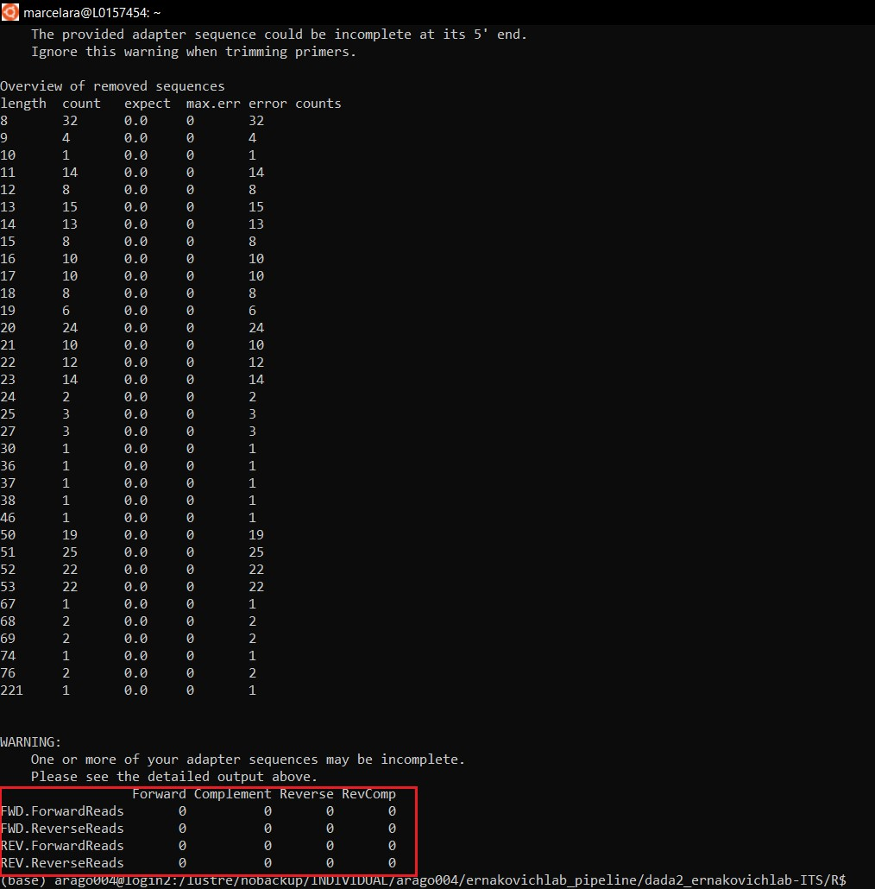


## 02_check-quality

In this script you'll get qualit plots which tell you from 20 random samples how is the quality of your reads (quality score) according to the place of the bp 


**R script**

Nothing changes


**slurm script**


``` bash

#!/bin/bash -login

#SBATCH --time=01:00:00                            ### limit of wall clock time - how long the job will run (same as -t)
#SBATCH --ntasks=1                                ### number of tasks - how many tasks (nodes) that you require (same as -n)
#SBATCH --cpus-per-task=16                         ### number of CPUs (or cores) per task (same as -c)
#SBATCH --mem=64G                                  ### memory required per node - amount of memory (in bytes)

conda activate dada2_ernakovich

Rscript ../R/02_check_quality_dada2_tutorial_16S.R

conda deactivate

```


**Output**

After this script there will be a new folder named `02_filter` in your working directory, in there you (Fig. 11). 


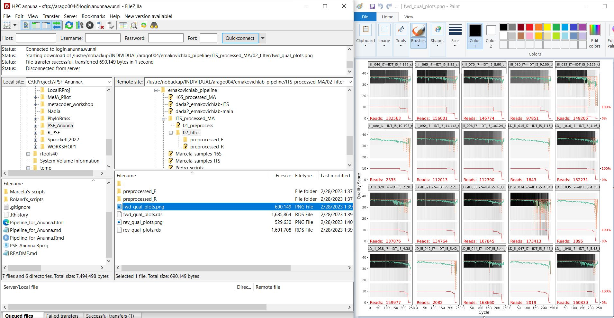


In this plot, each plot is one randome sample, the red line shows the percentage of reads that reach at least that position. In this example we can see that 100% of the reads from all the 20 random samples have >150 bp but not all get to 200bp (i.e. sample 126 in the upper right), showing the variable length of the ITS region. We can also get a sense of how many reads more or less we have per sample, in this example there are 3 samples with very few reads (~ <200). 


## 03_filter_reads

In here you will filter out those reads that don't match your criteria based on the quality plots from script 02. 

**R script**


``` r
# PEDRO's ajustment was to remove truncation (our reads are very short) and reduce max error allowed maxEE to 1 (we have good quality)
filt_out <- filterAndTrim(fwd=file.path(subF.fp, fastqFs), filt=file.path(filtpathF, fastqFs),
                          rev=file.path(subR.fp, fastqRs), filt.rev=file.path(filtpathR, fastqRs),
                          truncLen=c(0,0), maxEE=c(1,1), truncQ=2, maxN=0, rm.phix=TRUE, 		# Kris changed: truncLen = c(250,220)
                          compress=TRUE, verbose=TRUE, multithread=TRUE)                    # to c(0,0) maxEE=c(2,2) to c(2,2)
```

As for ITS data the length is variable is important to remove the `truncLen` argument. See more explanation in this tutorial (https://benjjneb.github.io/dada2/ITS_workflow.html)


**slurm script**


``` bash

#!/bin/bash -login

#SBATCH --time=01:00:00                            ### limit of wall clock time - how long the job will run (same as -t)
#SBATCH --ntasks=1                                ### number of tasks - how many tasks (nodes) that you require (same as -n)
#SBATCH --cpus-per-task=16                         ### number of CPUs (or cores) per task (same as -c)
#SBATCH --mem=64G                                  ### memory required per node - amount of memory (in bytes)

conda activate dada2_ernakovich

Rscript ../R/03_filter_reads_dada2_tutorial_16S.R

conda deactivate

```


**output**

You'll get new quality score plots after the adjustments of the same 20 random samples (Fig. 11). 

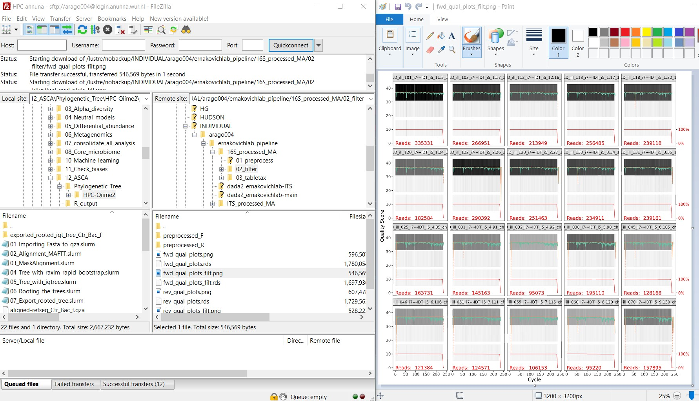

You can see that now there are less reads per sample (filtered out). 


## 04_learn_error_rates_dada2_tutorial_16S

Training and testing 4 different methods to distinguish between sequencing errors and biological differences. THIS is the reason why we are doing all this, because NovaSeq data "bins" error scores to just 4 categories instead of 40 like MiSeq, therefore it has less "resolution" (only 10%) to understand the "real" error rates (you have to "pay" this as you have more reads, otherwise it will be way too much information). There's not yet a standard solution to fix this, but it is clear that using the traditional way its not suitable (see Fig. 13), thus what Ernakovich lab does is to put together 4 different ways to learn error rates so you can choose, according to your data, which one is better (or less worse you can also say).

Because we don't fully understand it, we will not go into details of how and why these 4 error rates learning options are different. If you would like to know more you can check the explanation on their GitHub page and try to understand the different codes. What we believe is important is to realize that there are different ways to do it, and that which one is better to choose will depend **every time** entirely on your dataset. The way I see it is it's like checking your data distribution before you run a statistical test, sometimes is normal and sometimes is not and when it's not you have to select the appropriate data distribution so your statistical test has meaning.

Now, let's look at what changes we've made to the slurm and .R files:


**R**


``` r
# Sample names in order #PEDRO's alteration
sample.names <- basename(filtFs) # doesn't drop fastq.gz
sample.names <- gsub("_R1.fastq.gz", "", sample.names)
sample.namesR <- basename(filtRs) # doesn't drop fastq.gz 
sample.namesR <- gsub("_R2.fastq.gz", "", sample.namesR)
```

In the R script just be sure to check how your file names are ended.


**Slurm**


``` bash

#!/bin/bash -login

#SBATCH --time=12:00:00
#SBATCH --ntasks=1
#SBATCH --cpus-per-task=16
#SBATCH --mem=128G
#SBATCH --job-name="04_learn_error_rates_dada2"
#SBATCH --output="04_learn_error_rates_%j.output"

conda activate dada2_ernakovich

Rscript ../R/04_learn_error_rates_dada2_tutorial_16S.R

conda deactivate

```


**Output**

After you run the `04_learn_error_rates_dada2_tutorial_16S.R` script you can find different plots that will show you how, according to each of the 4 options, your learned error rates (black dots and lines) match an expected value (red lines). You'll see that in any of the 4 options there's a perfect match but what Ernakovich's lab recommend is to check that your dots are somewhat close to your black lines and that this lines should decrease along the x-axis (see their better explanation for this).

You can find these plots named `eerF_plot.rds`, `eerF_plot1.rds`, `eerF_plot2.rds`, `eerF_plot3.rds` and `eerF_plot4.rds` on your *working directory* folder --> `02_filter` --> `preprocessed_F` & `preprocessed_R` --> `filtered` (all the way down, after you've passed all your .gz sequences, Fig. 12).

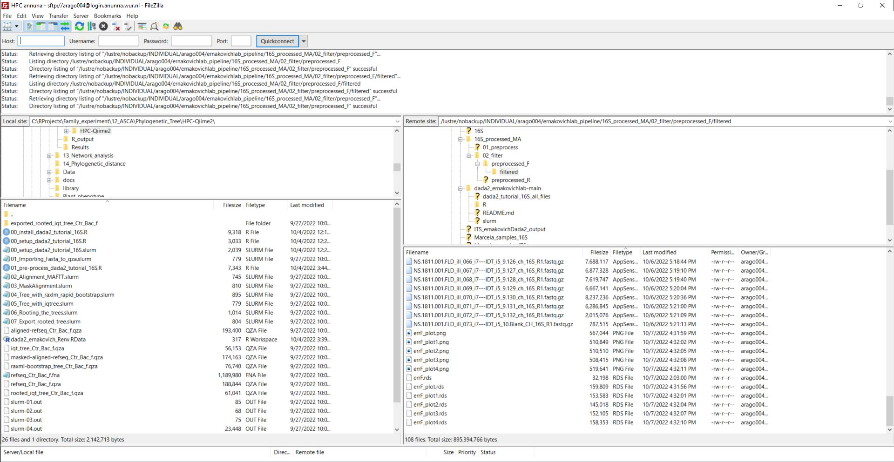

As you see, you'll have 2 plots per error model per forward and reverse = 8 plots (+2 of traditional example just to compare). We suggest you to transfer them to you computer and paste them on some slides so you can compare between them on one go.

With my samples I got this output:

**Traditional way**


As you can see if I was to use the traditional way my results would be a bit crappy

**Option 1**


Doesn't look that bad

**Option 2**


It looks off --> not the one to choose

**Option 3**


Doesn't look that bad but Option 1 still looks better

**Option 4**

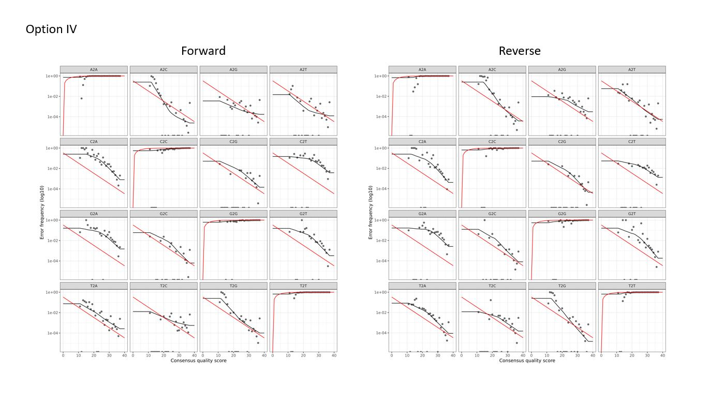

Also doesn't look that bad, so now it's between Option 1 and Option 4.

**Comparison between 1 and 4**


Honestly I can't see a difference between these 2 options, both of them go down across the x axis and points seem to be scattered in the same way across the black line. Looking at this **I will choose Option IV**, only for the reason of keeping it consistent with Pedro's choice for the Family Experiment (where half of my samples come from). This error rate learning option will be used on Script 05.

## 05_infer_ASVs_dada2_tutorial_16S

On this script you infer which reads belong to which ASV taking into account the error rates from step 04. Dada2 allows you to assign this by either pooling all your samples (`pool=TRUE`) or processing each sample independently (`pool=FALSE`), the difference between these 2 options are that pooling increases your "resolution" on rare taxa but requires much more computational time. As explained in the [dada2 site](https://benjjneb.github.io/dada2/pool.html), differences between these 2 options are in the example that they used less than 1% on the total number of ASVs. For this reason, we'll go without pooling and choose the fast method. If you are interested in rare taxa, consider changing to `pool=FALSE` setting.

Now, let's look at what changes we've made to the .R and .slurm files:

**R**


``` r
# For each sample, get a list of merged and denoised sequences
for(sam in sample.names) {
  cat("Processing:", sam, "\n")
  # Dereplicate forward reads
  derepF <- derepFastq(filtFs[[sam]])
  # Infer sequences for forward reads
  dadaF <- dada(derepF, err = errF_4, multithread = TRUE) #here is where you change to Option 4 for F
  ddF[[sam]] <- dadaF
  # Dereplicate reverse reads
  derepR <- derepFastq(filtRs[[sam]])
  # Infer sequences for reverse reads
  dadaR <- dada(derepR, err = errR_4, multithread = TRUE) #here is where you change to Option 4 for R
  ddR[[sam]] <- dadaR
  # Merge reads together
  merger <- mergePairs(ddF[[sam]], derepF, ddR[[sam]], derepR)
  mergers[[sam]] <- merger
}
```


**slurm**


``` bash

#!/bin/bash -login

#SBATCH --time=16:00:00
#SBATCH --ntasks=1
#SBATCH --cpus-per-task=16
#SBATCH --mem=64G
#SBATCH --job-name="05_infer_ASVs_dada2"
#SBATCH --output="05_infer_ASVs_dada2_%j.output"

conda activate dada2_ernakovich

## Instruct your program to make use of the number of desired threads.
## As your job will be allocated an entire node, this should normally
## be 24.
Rscript ../R/05_infer_ASVs_dada2_tutorial_16S.R

conda deactivate

```


**output** 

After sbatching this script and if everything goes well you should have in your `05_infer_ASVs_dada2_numberX.output` file something like this:

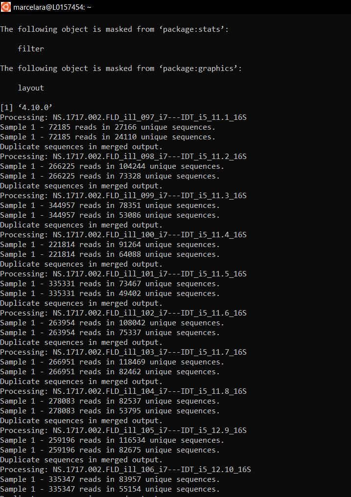

followed by a tail of this:


--> Now you are ready for Script 06!

## 06_remove_chimeras_dada2_tutorial_16S

Now comes the last script from the dada2-Ernakovich pipeline in which you will remove chimeras (and originally also asign the taxonomy to your ASV sequences). [Chimeras](https://en.wikipedia.org/wiki/Chimera_(molecular_biology)) are hybrid ASV sequences that are a by-product of the PCR amplification in which the extension step on ASV 'A' gets aborted and the resulting short aborted sequence is then used in the next cycle as a "primer" to amplify another ASV 'B'. The product of this is a 'ASV A-B' chimeric sequence, and you don't want those in your data as they are not real (but some sort of Frankestein ASV) and could take you to misleading results. Hence, in this part the pipeline looks for those chimeric sequences and removes them from your ASV table, for details check the [Ernakovich GitHub](https://github.com/ErnakovichLab/dada2_ernakovichlab) or [Dada2](https://benjjneb.github.io/dada2/tutorial.html) pipeline.

Originally, this script's name is `06_remove_chimeras_assign_taxonomy_dada2_tutorial_16S.R` as it also included a step in which you use a reference database to assign taxonomy to your ASV table. We will not do this as it was noticed by Pedro Beschoren and Roland Berdaguer that assigning taxonomy with dada2 `dada2::assignTaxonomy()` resulted in much more 'NAs' (taxonomy not assigned) than when using Qiime2 (classify-sklearn) instead. For this reason we'll keep this step 06 to just remove chimeras and get a final ASV table that we'll use later as input for step 07 in which we will assign taxonomy with Qiime2.

I used diffcheck to see [differences in the code](https://www.diffchecker.com/KLRB94HM) between Roland (removed taxonomy) and Pedro (extra filtering step) and renamed the files to remove the `assign_taxonomy` part from the title:


``` bash

#' In the R folder 
mv 06_remove_chimeras_assign_taxonomy_dada2_16S.R 06_remove_chimeras_dada2_16S.R


#' In the slurm folder
mv 06_remove_chimeras_assign_taxonomy_dada2_tutorial.slurm 06_remove_chimeras_dada2_tutorial.slurm

```

Be careful to adjust to the new name when necessary.

Part 04 removes chimeras and part 05 makes a summary of all the reads across the other scripts.

**R**

_All parts from assigning taxonomy were removed_

An extra filtering step (Pedro Beschoren) was added so final object was not that heavy to handle locally in R studio

I included a step to save the taxonomy table without filtering first so we can compare it later:


``` r
# Write results to disk
saveRDS(seqtab.nochim, paste0(table.fp, "/seqtab_final_nofiltered.rds")) #save it so you see the difference in size 
```

Then added Pedro's filtering steps


``` r
# PEDRO'S ALTERATION: check number of columns (ASV) per rows (samples) of the original object and when reducing the number of ASVs by minimal abundance
# number of samplex X ASVs in full dataset, and then the same dataset by filtering more than 0, 1, 2, 3 occurences
dim(seqtab.nochim)
dim(seqtab.nochim[,colSums(seqtab.nochim)>0])
dim(seqtab.nochim[,colSums(seqtab.nochim)>1])
dim(seqtab.nochim[,colSums(seqtab.nochim)>2])
dim(seqtab.nochim[,colSums(seqtab.nochim)>3])

# PEDRO'S ALTERATION: overwrite the ASV table, removing ASVs that do not appear at least 3 times
# this is necessary because the original 'no_filtered' table might be too large to be processed by R in our local computers
# and anyhow you will need to make the same filtering of less than 3 occurrences per ASV after, so we better do it from now.
seqtab.nochim<-seqtab.nochim[,colSums(seqtab.nochim)>2]

# Write results to disk
saveRDS(seqtab.nochim, paste0(table.fp, "/seqtab_final.rds"))
```

Changed names inside of function and save only the repset in .fasta and .txt formats


``` r
# Write repset to fasta file
# create a function that writes fasta sequences
writeRepSetFasta<-function(data, filename){
  fastaLines = c()
  for (rowNum in 1:nrow(data)){
    fastaLines = c(fastaLines, as.character(paste(">", data[rowNum,"ASV_ID"], sep = ""))) #changed
    fastaLines = c(fastaLines,as.character(data[rowNum,"ASV"])) #changed
  }
  fileConn<-file(filename)
  writeLines(fastaLines, fileConn)
  close(fileConn)
}

# write repset to fasta file
writeRepSetFasta(rep_set_ASVs, paste0(table.fp, "/repset.fasta"))

# Also export files as .txt
write.table(seqtab.t, file = paste0(table.fp, "/seqtab_final.txt"),
            sep = "\t", row.names = TRUE, col.names = NA)
```

**slurm**


``` bash

#!/bin/bash -login

#SBATCH --time=16:00:00
#SBATCH --ntasks=1
#SBATCH --cpus-per-task=16
#SBATCH --mem=128G
#SBATCH --job-name="06_remove_chimeras"
#SBATCH --output="06_remove_chimeras_dada2_%j.output"

conda activate dada2_ernakovich

Rscript ../R/06_remove_chimeras_dada2_tutorial_16S.R

conda deactivate

```


**output**

For my samples it took about \~2 hours to run,

In my `06_remove_chimeras_dada2_###.output` file I had something like this at the beginning:

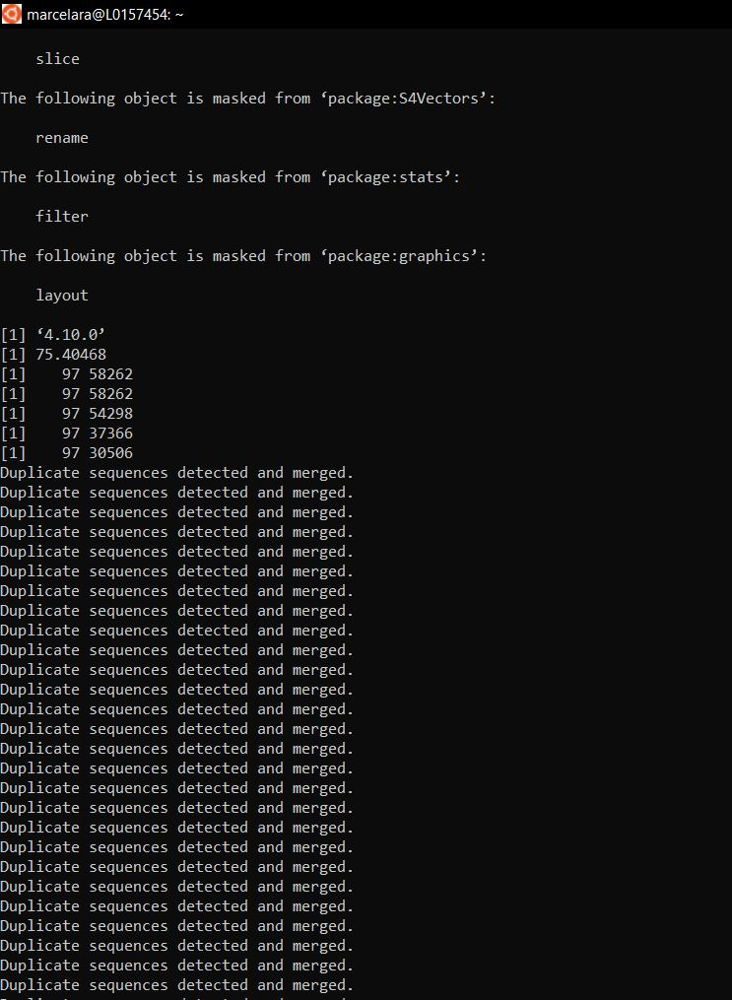

that finished with this:

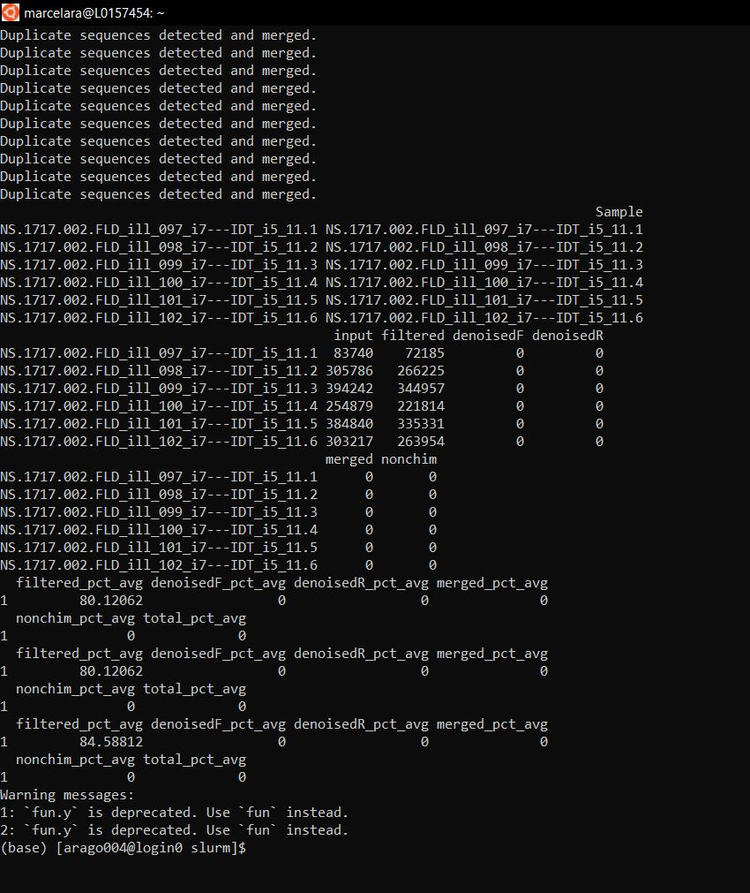

I found strange that in denoised F and denoised R I have `0`, so I check the `tracking_reads_summary_plot.png` file (Fig. 23) and saw that something must have gone wrong after the filtering step!!


After trying several things I realized that the process was okay and I didn't have 0 reads at the end but the 'Sample' names were not the same for all dataframes that were joined so I had to modify a bit again the R script to:


``` r
# tracking reads by counts
filt_out_track <- filt_out %>%
  data.frame() %>%
  mutate(Sample = gsub("_R1.fastq.gz","",rownames(.))) %>% #changed to avoid mistake
  rename(input = reads.in, filtered = reads.out)
rownames(filt_out_track) <- filt_out_track$Sample
```

Be careful to change in between the "" with how your files are ending!!

After doing this, then I get this new `tracking_reads_summary_plot.png`:


It looks like something went wrong in the 'Merging' step of the 16S data as the number of reads drop about 20%. 

***This needs to be checked (MA)***
STILL NEED TO GO BACK AND CHECK 'MERGE PAIRED READS' STEP from DADA2!! ([\<https://benjjneb.github.io/dada2/tutorial.html>](https://benjjneb.github.io/dada2/tutorial.html){.uri})

Not like the ITS data that looks a bit better (Fig. 25)

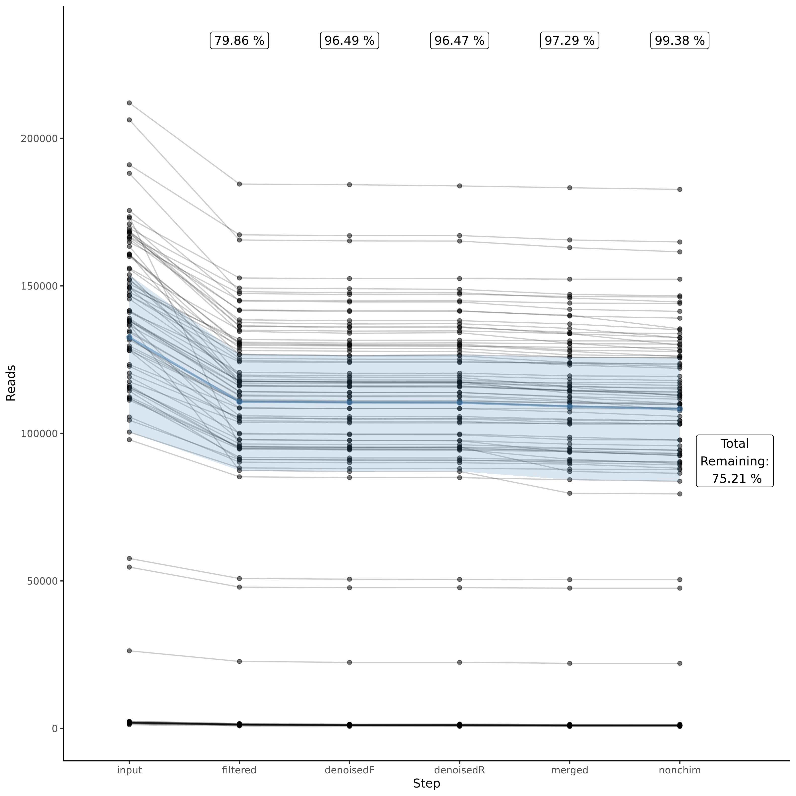]

## 07_Assigning taxonomies to ASVs

As mentioned before we will now assign taxonomy to each of our ASVs according to the [SILVA rRNA database](https://www.arb-silva.de/) which is a huge database that matches taxonomy with the sequence of the small subunit of ribosomal RNA (16S/18S). This step will be a bit different of what we've been doing as it will not run in R but in Qiime2.

[Qiime2](https://docs.qiime2.org/2022.8/about/) is a streamlined pipeline used to analyze microbiome data. It takes you from the very start (raw reads) and it finishes with multiple options of statistical analysis and visualizations. For another explanation/summary of Qiime2, you can visit this tutorial: [https://hackmd.io/\@MAE-MBL/HylpoaOF5#Bioinformatics-III-qiime2](https://hackmd.io/@MAE-MBL/HylpoaOF5#Bioinformatics-III-qiime2) that I find easier to follow than the original one. One of the steps of the Qiime2 pipeline is, of course, to assign taxonomy to ASVs according to a (*trained*) database.

I highlight the word *trained* as this is an **extra step** that you will have to do in case you didn't use the same primers we did (see table below) for your 16S/ITS regions. In a nutshell, training means that you keep only the region of your interest so the SILVA database can assign taxonomy with more accuracy.If you need to train your classifier, please follow [this tutorial to train your SILVA database with RESCRIPt](https://forum.qiime2.org/t/processing-filtering-and-evaluating-the-silva-database-and-other-reference-sequence-data-with-rescript/15494).

Set of 16S and ITS primers used

+-----------+-----------+-------------------------+-----------+--------------------------+
|           | 16S       | 16S                     | ITS       | ITS                      |
+===========+:=========:+:=======================:+:=========:+:========================:+
|           | Region    |                         | Region    |                          |
+-----------+-----------+-------------------------+-----------+--------------------------+
| Forward   | 341f      | "CCTACGGGNGGCWGCAG"     | ITS1F     | "CTTGGTCATTTAGAGGAAGTAA" |
+-----------+-----------+-------------------------+-----------+--------------------------+
| Reverse   | 805r      | "GACTACHVGGGTATCTAATCC" | ITS2R     | "GCTGCGTTCTTCATCGATGC"   |
+-----------+-----------+-------------------------+-----------+--------------------------+


As I'm using the same primers to amplify the V3-V4 16S region that both Pedro and Roland used, I can use the same already-trained SILVA database that they used and skip the training step.

To run Qiime2 you need to [install it, and activate within a conda environment inside the HPC](https://docs.qiime2.org/2022.8/install/native/#install-qiime-2-within-a-conda-environment) if you don't have it already installed. The instructions are straightforward, but most likely this step will take you time as you'll have to wait some time for conda and plug-ins to get downloaded (so take it into account).

Once installed, you'll have to run script 07 which it will be the actual script that you'll run directly with *sbatch* (not like the previous R scripts).

You'll find your ASV table inside of _Working directory_ --> `03_tabletax` --> `repset.fasta`. First you convert it to an 'artifact' that Qiime2 understands (from .fasta to .qza), then you assign taxonomy with your trained database, in my case `silva-138.1-ssu-nr99-341f-805r-classifier.qza` that I obtained from Roland and Pedro and copied to the main folder beforehand. And then, you export the final taxonomy file into a new folder `16S_sklearn_taxonomy`. 

For ITS, we used the UNITE database `unite-tax-ver9_dynamic_all_29.11.2022_dev.qza` 

**slurm**


``` bash

#!/bin/bash -login

#SBATCH --time=16:00:00                                 ### limit of wall clock time - how long the job will run (same as -t)
#SBATCH --ntasks=1                                            ### number of tasks - how many tasks (nodes) that you require (same as -n)
#SBATCH --cpus-per-task=16                        ### number of CPUs (or cores) per task (same as -c)
#SBATCH --mem=64G                                               ### memory required per node - amount of memory (in bytes)
#SBATCH --job-name="07_assing_taxonomy_sklearn"                 ### you can give your job a name for easier identification (same as -J)
#SBATCH --output="07_assign_taxonomy_sklearn_%j.output"

# activates qiime2 environment
conda activate qiime2-2022.8 #change here for your version of qiime2

# imports representative sequences in FASTA format
qiime tools import \
  --input-path /lustre/nobackup/INDIVIDUAL/arago004/ernakovichlab_pipeline/16S_processed_MA/03_tabletax/repset.fasta \
  --output-path /lustre/nobackup/INDIVIDUAL/arago004/ernakovichlab_pipeline/16S_processed_MA/03_tabletax/rep-seqs_16S.qza \
  --type 'FeatureData[Sequence]'


# assing taxonomy ranks on your representative sequences, based on the trained SILVA reference
qiime feature-classifier classify-sklearn \
  --i-classifier /lustre/nobackup/INDIVIDUAL/arago004/ernakovichlab_pipeline/silva-138.1-ssu-nr99-341f-805r-classifier.qza \
  --i-reads /lustre/nobackup/INDIVIDUAL/arago004/ernakovichlab_pipeline/16S_processed_MA/03_tabletax/rep-seqs_16S.qza \
  --o-classification /lustre/nobackup/INDIVIDUAL/arago004/ernakovichlab_pipeline/16S_processed_MA/03_tabletax/taxonomy_16S.qza


# Export the taxonomy from the .qza taxonomy assignment trained with the correct primer set, it also creates a new folder in the process
qiime tools export \
--input-path /lustre/nobackup/INDIVIDUAL/arago004/ernakovichlab_pipeline/16S_processed_MA/03_tabletax/taxonomy_16S.qza \
--output-path /lustre/nobackup/INDIVIDUAL/arago004/ernakovichlab_pipeline/16S_processed_MA/03_tabletax/16S_sklearn_taxonomy

conda deactivate

```

**output**

the `07_assign_taxonomy_sklearn_#.output` file should contain just a couple of lines letting you know that all the steps you asked for were made:


``` bash

Imported /lustre/nobackup/INDIVIDUAL/arago004/ernakovichlab_pipeline/16S_processed_MA/03_tabletax/repset.fasta as DNASequencesDirectoryFormat to /lustre/nobackup/INDIVIDUAL/arago004/ernakovichlab_pipeline/16S_processed_MA/03_tabletax/re$Saved FeatureData[Taxonomy] to: /lustre/nobackup/INDIVIDUAL/arago004/ernakovichlab_pipeline/16S_processed_MA/03_tabletax/taxonomy_16S.qza
Exported /lustre/nobackup/INDIVIDUAL/arago004/ernakovichlab_pipeline/16S_processed_MA/03_tabletax/taxonomy_16S.qza as TSVTaxonomyDirectoryFormat to directory /lustre/nobackup/INDIVIDUAL/arago004/ernakovichlab_pipeline/16S_processes/03_t$

```

## 08_Making phylogenetic tree 

This extra step is not necessary, but recommended before you start importing your data into R. So far you have almost everything ready, except you will be missing the phylogeny of your microbial ASVs. This is important as it will help you calculate distance metrics based on phylogenetic relationships such as [UniFrac](https://en.wikipedia.org/wiki/UniFrac).

To create a 'quick' phylogenetic tree you can follow this [Qiime2 tutorial for phylogenetic inference](https://docs.qiime2.org/2023.5/tutorials/phylogeny/) and use the summarized pipeline `align-to-tree-mafft-fasttree` to create your phylogenetic tree by using only one command. 


``` bash

#!/bin/bash -login

#SBATCH --time=08:00:00				  	### limit of wall clock time - original time was 8 hours
#SBATCH --ntasks=1					      ### number of tasks - how many tasks (nodes) that you require (same as -n)
#SBATCH --cpus-per-task=16			  ### number of CPUs (or cores) per task (same as -c)
#SBATCH --mem=32G					        ### memory required per node - amount of memory (in bytes)
#SBATCH --job-name="tree"			### you can give your job a name for easier identification (same as -J)
#SBATCH --output="tree_%j.output"


# activates qiime2 environment
conda activate qiime2-2022.8

#From Qiime2(https://docs.qiime2.org/2022.8/tutorials/phylogeny/):
#This pipeline will start by creating a sequence alignment using MAFFT,
#after which any alignment columns that are phylogenetically uninformative or ambiguously aligned will be removed (masked).
#The resulting masked alignment will be used to infer a phylogenetic tree and then subsequently rooted at its midpoint.
#Output files from each step of the pipeline will be saved.
#This includes both the unmasked and masked MAFFT alignment from q2-alignment methods, and both the rooted and unrooted phylogenies from q2-phylogeny methods.

#Import refseq from R in fasta format and change it to .qza for the pipeline to work
qiime tools import \
  --input-path /lustre/nobackup/INDIVIDUAL/arago004/ernakovichlab_pipeline/ITS_processed_MA/03_tabletax/repset.fasta \
  --output-path /lustre/nobackup/INDIVIDUAL/arago004/ernakovichlab_pipeline/ITS_processed_MA/repset_ITS.qza \
  --type 'FeatureData[Sequence]'

#Run qiime2 fast pipeline to make a phylogenetic tree
qiime phylogeny align-to-tree-mafft-fasttree \
  --i-sequences /lustre/nobackup/INDIVIDUAL/arago004/ernakovichlab_pipeline/ITS_processed_MA/repset_ITS.qza \
  --output-dir /lustre/nobackup/INDIVIDUAL/arago004/ernakovichlab_pipeline/ITS_processed_MA/04_phylogenetic_tree

# export tree from .qza to .nwk format
qiime tools export \
  --input-path /lustre/nobackup/INDIVIDUAL/arago004/ernakovichlab_pipeline/ITS_processed_MA/04_phylogenetic_tree/rooted_tree.qza \
  --output-path /lustre/nobackup/INDIVIDUAL/arago004/ernakovichlab_pipeline/ITS_processed_MA/04_phylogenetic_tree/exported_rooted_tree

conda deactivate

```

Now you'll have your tree in a `tree.nwk` file inside of _Working directory_ --> `04_phylogenetic_tree` --> `exported_rooted_tree`


## 09_Importing data to R

And that's it, you've made it! Now you are ready to import your data to R. The files that you will need are:

Inside of the `03_tabletax` folder(3):

1. The `seqtab_final.txt` or `seqtab_final.rds`--> that will be your OTU table (otu_table) The .rds is lighter than the .txt
2. `repset.fasta` --> that will be the DNA sequences for each ASV (refseq)
3. `taxonomy.tsv` --> that will be your the taxonomy table (tax_table)

Inside of the `04_phylogenetic_tree` --> `exported_rooted_tree`(1):

4.`tree.nkw`  --> the phylogenetic tree [Optional]

And finally, inside of your main _Working directory_ folder (1):

5. The **metadata** file, in my case `Mapping_file_16S_Family_experiment.txt` that will be my metadata (sample_data) 

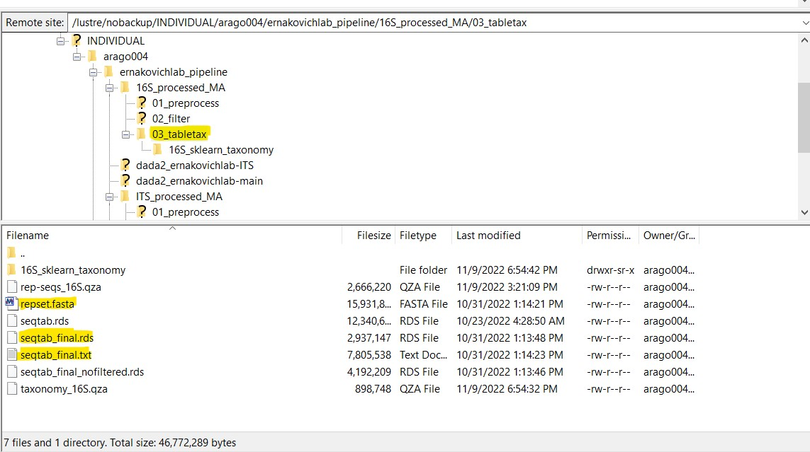

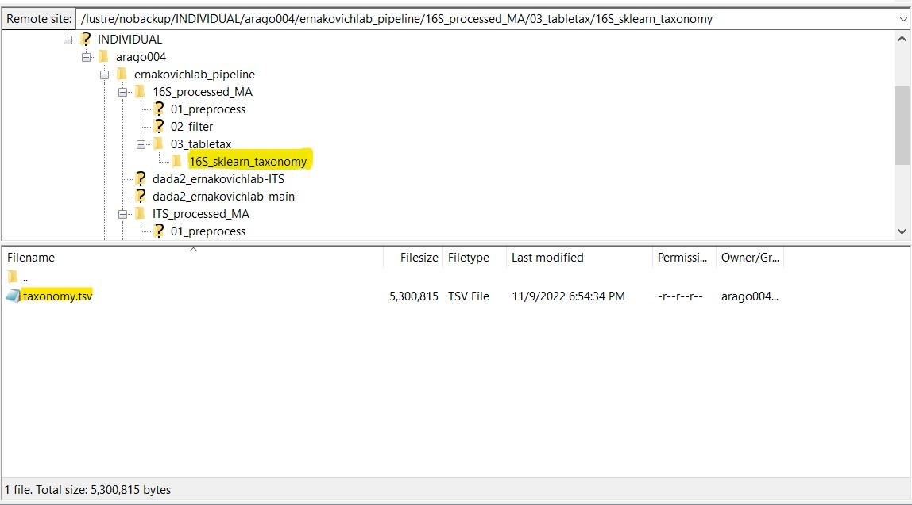

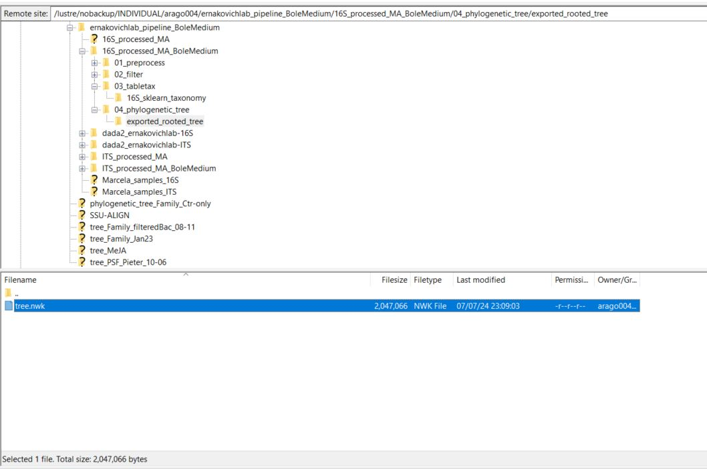

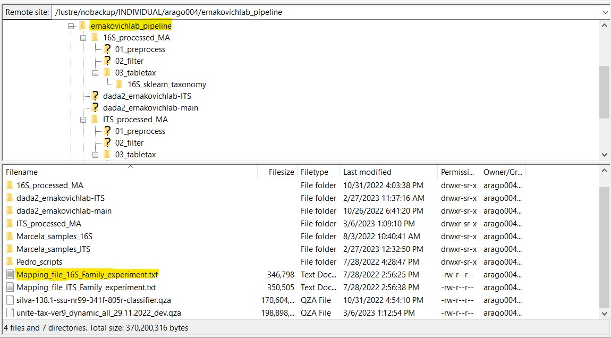


Finally, transfer these 5 files to your local computer and think about whether you would like to re-name them so their title is a bit more informative. For instance to track back that were for 16S and not ITS ;)


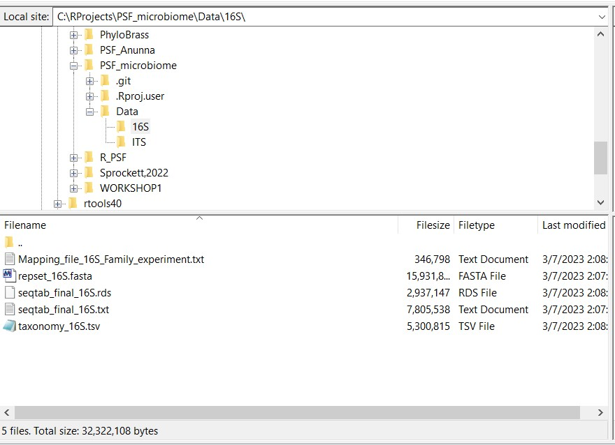


